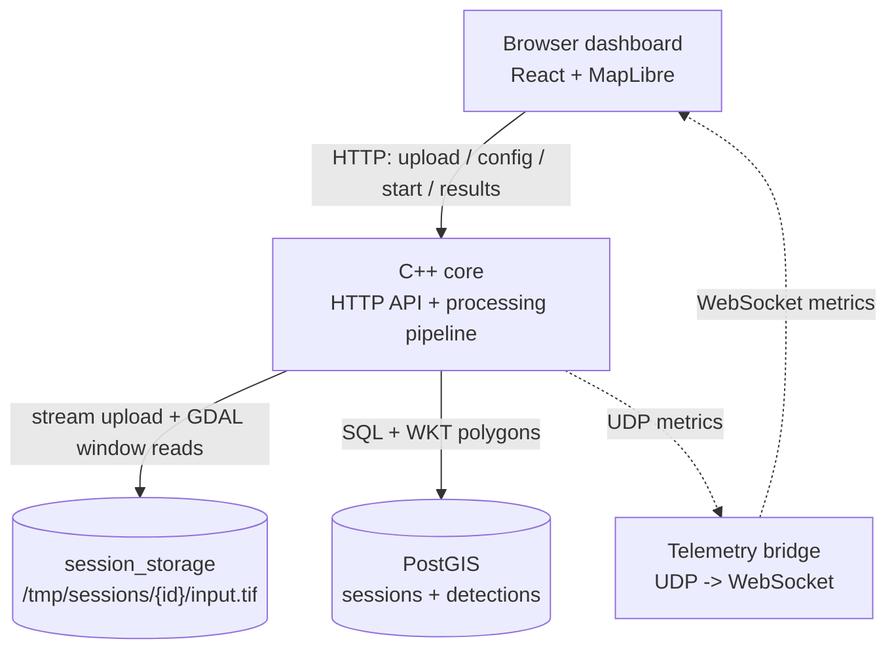
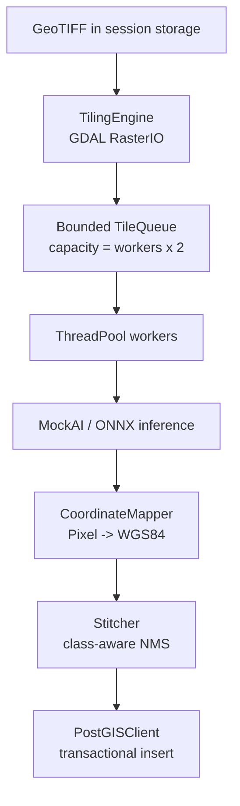

# Pipeline Xử Lý Ảnh Viễn Thám

Pipeline C++ để xử lý và phân tích ảnh viễn thám khổ lớn như GeoTIFF từ vệ tinh, UAV hoặc ảnh hàng không. Hệ thống không nạp toàn bộ ảnh vào RAM, mà stream file upload xuống vùng lưu session, đọc ảnh theo tile bằng GDAL, chạy AI inference trên nhiều worker, ánh xạ kết quả từ pixel sang WGS84, lưu polygon vào PostGIS và hiển thị kết quả trên dashboard React/MapLibre.

Các backend AI hiện có: MockAI, YOLOv8n-seg COCO, YOLO11n-OBB DOTA và SegFormer LoveDA.

---

## Mục Lục

- [Tính năng chính](#tính-năng-chính)
- [Kiến trúc](#kiến-trúc)
- [Luồng xử lý](#luồng-xử-lý)
- [Công nghệ sử dụng](#công-nghệ-sử-dụng)
- [Cấu trúc thư mục](#cấu-trúc-thư-mục)
- [Tài liệu chi tiết](#tài-liệu-chi-tiết)
- [Chạy nhanh](#chạy-nhanh)
- [HTTP API](#http-api)
- [Model AI](#model-ai)
- [Cấu hình pipeline](#cấu-hình-pipeline)
- [Kiểm thử](#kiểm-thử)
- [Kết quả đo hiệu năng](#kết-quả-đo-hiệu-năng)
- [Land-cover coverage](#land-cover-coverage)
- [Hạn chế hiện tại](#hạn-chế-hiện-tại)

---

## Tính Năng Chính

- Upload GeoTIFF bằng HTTP và stream trực tiếp xuống disk, không giữ toàn bộ file trong RAM.
- Lưu ảnh upload theo session tại Docker named volume `session_storage`, mount trong container ở `/tmp/sessions/{id}/input.tif`.
- Đọc ảnh theo cửa sổ nhỏ bằng GDAL `RasterIO`.
- Chia tile có overlap và xử lý được tile ở biên ảnh.
- Dùng bounded queue để tạo backpressure, tránh tích lũy vô hạn tile trong RAM.
- Chạy nhiều worker thread C++ và nhiều ONNX Runtime session.
- Chuyển polygon từ tọa độ pixel của tile sang WGS84 EPSG:4326.
- Stitching/NMS kết quả sau worker để giảm duplicate ở vùng overlap.
- Lưu polygon vào PostGIS với GiST index.
- Trả kết quả dạng GeoJSON và tính land-cover coverage theo footprint GeoTIFF.
- Gửi telemetry CPU, RAM, FPS, queue size, state và progress qua UDP.
- Dùng Node.js bridge để chuyển UDP telemetry sang WebSocket cho trình duyệt.
- Frontend React + MapLibre hiển thị tiến độ, telemetry, polygon, thống kê class và coverage.
- Chuyển lỗi file, worker, database hoặc cancel thành trạng thái `ERROR` thay vì làm crash service.

---

## Kiến Trúc



Trong `cpp-core`, pipeline dùng mô hình producer-consumer:



### Điểm quan trọng

- Thread pipeline là producer, không có thread tiling riêng.
- Worker lấy `TileData` từ bounded queue.
- Queue đầy thì producer bị block, nhờ đó RAM không tăng theo tổng số tile.
- `Detection` là kết quả AI trong pixel-space của tile.
- `GeoDetection` là kết quả sau khi `CoordinateMapper` chuyển polygon sang WGS84.
- `Stitcher` nhận `GeoDetection`, dùng bbox tạm để tính IoU, nhưng output vẫn giữ polygon WGS84.

---

## Luồng Xử Lý

1. `POST /upload` tạo session và stream file vào `/tmp/sessions/{id}/input.tif`.
2. Client frontend gửi cấu hình tile size, overlap, worker, model và confidence.
3. GDAL mở file, đọc metadata, geotransform và CRS.
4. TilingEngine đọc từng tile từ disk và submit vào bounded queue.
5. Worker chạy AI inference trên `TileData`.
6. AI trả `vector<Detection>` với bbox/polygon theo pixel của tile.
7. `CoordinateMapper` chuyển sang `vector<GeoDetection>` WGS84.
8. Sau `waitAll()`, `Stitcher` chạy class-aware NMS.
9. `PostGISClient` chuyển polygon sang WKT và insert vào bảng `detections`.
10. `/results` trả GeoJSON và coverage cho frontend.

---

## Công Nghệ Sử Dụng

| Lớp | Công nghệ |
| --- | --- |
| Core backend | C++17, CMake, STL threads, atomics, condition variables |
| Raster I/O | GDAL 3.6.3 |
| Suy luận AI | ONNX Runtime 1.16.3, CPU Execution Provider |
| HTTP API | cpp-httplib |
| Cơ sở dữ liệu | PostgreSQL 15, PostGIS 3.3, libpqxx |
| Giao diện web | React, Vite, MapLibre GL JS, Recharts |
| Telemetry bridge | Node.js, UDP, WebSocket (`ws`) |
| Deploy | Docker, Docker Compose |

---

## Cấu Trúc Thư Mục

```text
.
|-- cpp-core/
|   |-- models/                 # Model ONNX cục bộ, không commit file lớn
|   |-- src/
|   |   |-- api/                # HTTP gateway và routes
|   |   |-- common/             # Types, logging
|   |   |-- database/           # PostGIS client, GeoJSON, coverage query
|   |   |-- inference/          # MockAI, YOLO, OBB, SegFormer
|   |   |-- monitoring/         # UDP telemetry
|   |   |-- pipeline/           # Tiling, queue, thread pool, mapping, state
|   |   `-- stitching/          # Global NMS
|   `-- tests/                  # Test StateMachine
|-- database/init.sql           # Schema PostGIS
|-- docs/                       # Tài liệu kỹ thuật chi tiết
|-- frontend/
|   |-- bridge.cjs              # UDP :9090 -> WebSocket :9091
|   `-- src/                    # React dashboard
|-- report/                     # Báo cáo LaTeX
|-- tools/stress_test.py        # Stress test 3 phiên liên tiếp
|-- data/samples/               # GeoTIFF mẫu cục bộ, không commit
`-- docker-compose.yml
```

---

## Tài Liệu Chi Tiết

- [Kiến trúc hệ thống](docs/ARCHITECTURE.md): service, volume, data flow, source map.
- [Luồng pipeline](docs/PIPELINE.md): từ upload đến `DONE`, bao gồm memory lifetime và error path.
- [Đa luồng và backpressure](docs/CONCURRENCY.md): ThreadPool, bounded queue, mutex, atomic, cancel.
- [Inference, stitching và coverage](docs/INFERENCE_AND_STITCHING.md): AI backend, coordinate mapping, NMS, PostGIS coverage.

---

## Chạy Nhanh

### 1. Yêu cầu

- Docker Desktop và Docker Compose.
- Node.js 20+ và npm.
- RAM tối thiểu 8 GB nếu chạy SegFormer trên CPU.
- Model ONNX đặt trong `cpp-core/models/`.

### 2. Cấu hình `.env`

Tạo file `.env` ở thư mục gốc:

```dotenv
POSTGRES_DB=remote_sensing
POSTGRES_USER=rsuser
POSTGRES_PASSWORD=rspassword
POSTGRES_HOST=postgis
POSTGRES_PORT=5432

HTTP_PORT=8080
UDP_PORT=9090
UDP_BROADCAST_INTERVAL_MS=500
```

### 3. Đặt model

```text
cpp-core/models/yolov8n-seg.onnx
cpp-core/models/yolo11n-obb.onnx
cpp-core/models/segformer-loveda-b2.onnx
cpp-core/models/segformer-loveda-b2.onnx.data
```

SegFormer dùng ONNX external data, vì vậy file `.onnx` và `.onnx.data` phải đi cùng nhau.

### 4. Start backend

```powershell
docker compose up --build postgis cpp-core
```

Kiểm tra API:

```powershell
Invoke-RestMethod http://localhost:8080/health
```

### 5. Start telemetry bridge

Trình duyệt không nhận UDP trực tiếp, nên bridge phải chạy trên host:

```powershell
cd frontend
npm install
npm run bridge
```

Bridge nhận UDP ở `9090` và mở WebSocket tại `ws://localhost:9091`.

### 6. Start frontend dev

```powershell
cd frontend
npm run dev
```

Mở [http://localhost:5173](http://localhost:5173), chọn model, cấu hình, rồi upload GeoTIFF.

---

## HTTP API

| Phương thức | Endpoint | Chức năng |
| --- | --- | --- |
| `GET` | `/health` | Kiểm tra service |
| `POST` | `/upload` | Stream GeoTIFF vào vùng lưu session |
| `POST` | `/sessions/{id}/config` | Cấu hình pipeline |
| `POST` | `/sessions/{id}/start` | Bắt đầu xử lý bất đồng bộ |
| `POST` | `/sessions/{id}/cancel` | Hủy session đang chạy |
| `GET` | `/sessions/{id}/status` | Lấy state, progress, lỗi và footprint |
| `GET` | `/sessions/{id}/results` | Lấy GeoJSON và coverage |

### Ví dụ PowerShell

```powershell
$path = "C:\data\image.tif"
$bytes = [System.IO.File]::ReadAllBytes($path)

$upload = Invoke-RestMethod `
  -Uri "http://localhost:8080/upload" `
  -Method POST `
  -Body $bytes `
  -ContentType "application/octet-stream" `
  -Headers @{ "X-Filename" = [System.IO.Path]::GetFileName($path) }

$sid = $upload.session_id

$config = @{
  model       = "segformer_loveda"
  model_path  = "/app/models/segformer-loveda-b2.onnx"
  tile_size   = 1024
  overlap     = 128
  max_workers = 4
  conf_thresh = 0.60
} | ConvertTo-Json

Invoke-RestMethod `
  -Uri "http://localhost:8080/sessions/$sid/config" `
  -Method POST `
  -ContentType "application/json" `
  -Body $config

Invoke-RestMethod `
  -Uri "http://localhost:8080/sessions/$sid/start" `
  -Method POST
```

Lưu ý: ví dụ trên đọc toàn bộ file vào RAM phía client PowerShell. Với file rất lớn, nên dùng frontend hoặc `curl --data-binary`.

---

## Model AI

| `model` | Artifact | Mục đích |
| --- | --- | --- |
| `mock` | Không cần model | Kiểm thử pipeline, API, queue, database |
| `onnx` | `yolov8n-seg.onnx` | Demo tích hợp ONNX COCO, không chuyên cho viễn thám |
| `dota_obb` | `yolo11n-obb.onnx` | Object detection ảnh hàng không độ phân giải cao |
| `segformer_loveda` | `segformer-loveda-b2.onnx` + `.onnx.data` | Land-cover segmentation |

Class của SegFormer LoveDA:

```text
Ignore, Background, Building, Road, Water, Barren, Forest, Agricultural
```

`Ignore` và `Background` không được vẽ thành polygon trên bản đồ.

---

## Cấu Hình Pipeline

| Trường | Giá trị hợp lệ | Ghi chú |
| --- | --- | --- |
| `tile_size` | `1..4096` | Kích thước cửa sổ đọc ảnh |
| `overlap` | `0..tile_size-1` | Vùng chồng lấp giữa tile |
| `max_workers` | `0..64` | `0` chọn gần bằng số hardware threads |
| `conf_thresh` | `0.0..1.0` | Ngưỡng confidence |
| `model` | Xem bảng model | Chọn backend AI |
| `model_path` | Đường dẫn trong container | Ví dụ `/app/models/...onnx` |

Gợi ý thực nghiệm:

- SegFormer: `tile_size=1024`, `overlap=128`, `max_workers=2..4`, `conf_thresh=0.45..0.60`.
- DOTA OBB: `tile_size=1024`, overlap đủ lớn để giữ vật thể ở biên tile.
- MockAI stress test: `tile_size=512`, `overlap=64`.

---

## Kiểm Thử

### Build backend

```powershell
docker compose build cpp-core
```

### Build frontend

```powershell
cd frontend
npm install
npm run build
```

### Test StateMachine

```powershell
docker build --target builder -t rs-pipeline-builder cpp-core
docker run --rm rs-pipeline-builder /app/build/test_state_machine
```

### Stress test

```powershell
python -m pip install requests
python tools/stress_test.py
```

Monitor RAM container:

```powershell
while ($true) {
  docker stats rs_cpp_core --no-stream --format "{{.MemUsage}}"
  Start-Sleep 1
}
```

---

## Kết Quả Đo Hiệu Năng

Các số liệu dưới đây là kết quả trên máy phát triển, không phải cam kết hiệu năng cố định.

| Bài kiểm thử | Cấu hình | Kết quả quan sát |
| --- | --- | --- |
| GeoTIFF synthetic + MockAI | 23,000 x 23,000, 2,704 tile, 3 lần chạy | 6.1-7.2 s pipeline; khoảng 462 MiB RAM; 8,093 detections ổn định |
| NAIP khoảng 467 MiB + SegFormer | tile 1024, overlap 128, 2 workers/sessions | khoảng 6 phút; khoảng 2.8 GB RAM; CPU khoảng 25% |
| NAIP khoảng 467 MiB + SegFormer | tile 1024, overlap 128, 4 workers/sessions | khoảng 4 phút 40 giây; khoảng 3.0 GB RAM; CPU khoảng 50% |

MockAI đo luồng tiling, queue, mapping, stitching và database; không đại diện cho tốc độ AI thật.

---

## Land-cover Coverage

Với SegFormer, `/results` trả thêm object `coverage`. Backend tính coverage bằng PostGIS, không tính diện tích trong browser.

```text
coverage = diện tích class không chồng lặp / diện tích footprint GeoTIFF * 100
```

Quy trình SQL:

1. Cắt polygon theo footprint ảnh.
2. Hợp nhất polygon cùng class để tránh đếm lặp.
3. Xử lý overlap giữa các class theo confidence.
4. Tính diện tích bằng `ST_Area(...::geography)`.
5. Tính `Unclassified = 100 - tổng coverage các class`.

`Unclassified` gồm Background, Ignore, pixel dưới confidence, vùng nhỏ bị lọc và vùng không sinh polygon. Nó không phải trực tiếp là tỷ lệ sai của model.

---

## Hạn Chế Hiện Tại

### AI và dữ liệu

- ONNX Runtime hiện chạy CPU, chưa bật CUDA, TensorRT, DirectML hoặc OpenVINO.
- Docker image hiện target Linux x86-64; ARM/Jetson chưa được kiểm thử.
- Backend hiện tạo input 3 channel, chưa khai thác đầy đủ ảnh multispectral nhiều band.
- YOLOv8n-seg COCO chỉ dùng như demo ONNX, không phù hợp để đánh giá chính xác ảnh viễn thám.
- Nếu model ONNX lỗi hoặc thiếu, pipeline có thể fallback sang MockAI sau khi log lỗi.

### Stitching và coverage

- SegFormer polygonize từng tile trước, chưa stitch mask/logit toàn cục.
- NMS dùng bbox tạm theo lon/lat degree, không phải polygon IoU trong CRS metric.
- NMS chỉ so sánh cùng class.
- Coverage resolve overlap để báo cáo thống kê, nhưng không sửa lại polygon đã lưu.

### Vận hành

- `StateMachine` đã có module và test, nhưng runtime vẫn cập nhật một số state trực tiếp trong `main.cpp`.
- Thread pipeline đang detached, chưa có graceful shutdown đầy đủ.
- PostGIS dùng một connection được bảo vệ bằng mutex, chưa có connection pool.
- `/results` trả toàn bộ GeoJSON một lần, có thể nặng khi polygon rất nhiều.
- API chưa có authentication, TLS, upload quota hoặc phân quyền người dùng.

---

## Phạm Vi Hiện Tại

Project hiện là prototype end-to-end cho bài toán xử lý ảnh viễn thám khổ lớn: đọc ảnh theo tile, xử lý đa luồng có backpressure, tích hợp AI backend thay thế được, chuyển tọa độ sang WGS84, lưu PostGIS, telemetry thời gian thực và trực quan hóa trên bản đồ.

Các hướng phát triển tiếp theo: mask-level stitching, model multispectral, GPU inference, streaming insert vào PostGIS và session scheduler cho môi trường production.
