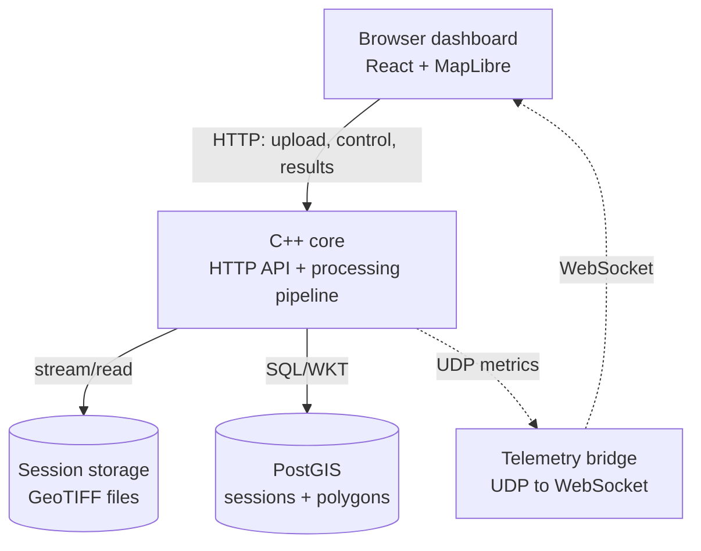
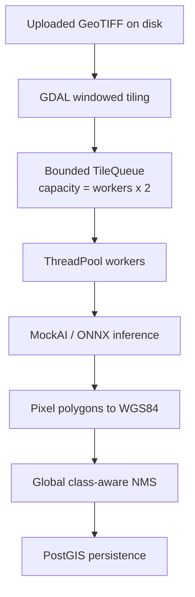
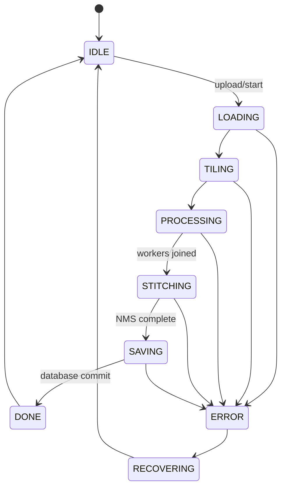

# Remote Sensing Pipeline

A containerized C++ pipeline for processing large geospatial rasters without
loading the complete image into memory. The system streams GeoTIFF uploads to
disk, reads overlapping windows with GDAL, runs tile-level AI inference in a
bounded worker pool, maps pixel results to WGS84, removes duplicate detections,
stores polygons in PostGIS, and renders the results in a React/MapLibre
dashboard.

The project currently supports mock inference, COCO object detection, DOTA
oriented object detection, and LoveDA land-cover segmentation through ONNX
Runtime.

## Contents

- [Features](#features)
- [Architecture](#architecture)
- [Processing lifecycle](#processing-lifecycle)
- [Technology stack](#technology-stack)
- [Repository layout](#repository-layout)
- [Documentation](#documentation)
- [Quick start](#quick-start)
- [Using the HTTP API](#using-the-http-api)
- [Models](#models)
- [Configuration](#configuration)
- [Testing](#testing)
- [Observed performance](#observed-performance)
- [Land-cover coverage](#land-cover-coverage)
- [Known limitations](#known-limitations)

## Features

- Streams uploaded GeoTIFF files directly to session storage.
- Reads raster windows from disk with GDAL instead of loading the full raster.
- Supports overlapping tile grids and edge tiles.
- Uses a bounded, thread-safe queue to apply backpressure to the tile producer.
- Runs multiple C++ worker threads and configurable ONNX Runtime sessions.
- Converts tile-local pixel polygons to EPSG:4326 with GDAL reprojection.
- Applies confidence-ordered, class-aware NMS after tile inference.
- Stores geospatial polygons in PostGIS with GiST indexes.
- Returns GeoJSON results and image-footprint-based land-cover coverage.
- Broadcasts CPU, RAM, throughput, queue depth, state, and progress over UDP.
- Relays UDP telemetry to browsers through a small Node.js WebSocket bridge.
- Displays progress, telemetry, class statistics, polygons, and coverage with
  React, MapLibre GL JS, and Recharts.
- Converts worker, database, corrupt-file, and cancellation failures into an
  `ERROR` session state instead of terminating the service.

## Architecture



Inside the C++ core, one pipeline thread produces tiles while a worker pool
consumes them:



### Producer-consumer flow

`TilingEngine::iterateTiles()` runs on the pipeline thread and is the producer.
Each tile contains an interleaved HWC byte buffer plus its source-image offset.
`ThreadPool` workers block on `TileQueue::pop()`, perform inference, and append
mapped results to a protected result vector.

The queue capacity is `worker_count * 2`. When it is full, `push()` blocks the
tiling producer until a worker removes a tile. This backpressure bounds queued
pixel memory independently of source raster size.

## Processing lifecycle

The standalone `StateMachine` module defines the intended lifecycle below. See
[Known limitations](#runtime-and-operations) for its current integration status.



At runtime, a session follows this practical flow:

1. `POST /upload` allocates a session and streams the request body to
   `/tmp/sessions/<id>/input.tif`.
2. The client validates and stores tile, overlap, worker, model, and confidence
   settings.
3. GDAL validates the file, reads metadata, builds the tile grid, and prepares
   the source-CRS-to-WGS84 transform.
4. The producer reads one raster window at a time and submits it to the bounded
   queue.
5. Workers run inference, vectorize outputs, and map tile pixels to WGS84.
6. The pipeline joins every worker, then runs class-aware NMS on one thread.
7. Final polygons are inserted into PostGIS in one transaction.
8. `/results` returns GeoJSON and calculates land-cover coverage against the
   GeoTIFF footprint.

## Technology stack

| Layer | Technology |
| --- | --- |
| Core | C++17, CMake, STL threads/atomics/condition variables |
| Raster I/O | GDAL 3.6.3 |
| Inference | ONNX Runtime 1.16.3, CPU execution provider |
| HTTP | cpp-httplib |
| Spatial database | PostgreSQL 15, PostGIS 3.3, libpqxx |
| Frontend | React 19, Vite 8, MapLibre GL JS, Recharts |
| Telemetry bridge | Node.js, UDP, WebSocket (`ws`) |
| Deployment | Docker, Docker Compose |

## Repository layout

```text
.
|-- cpp-core/
|   |-- models/                 # Local ONNX files; large files are ignored
|   |-- src/
|   |   |-- api/                # HTTP gateway and routes
|   |   |-- common/             # Shared types and logging
|   |   |-- database/           # PostGIS client and GeoJSON/coverage queries
|   |   |-- inference/          # Mock, YOLO, OBB, and SegFormer backends
|   |   |-- monitoring/         # UDP system and pipeline metrics
|   |   |-- pipeline/           # Tiling, queue, thread pool, mapping, states
|   |   `-- stitching/          # Global NMS
|   `-- tests/                  # C++ state-machine tests
|-- database/init.sql           # PostGIS schema and indexes
|-- frontend/
|   |-- bridge.cjs              # UDP :9090 to WebSocket :9091
|   `-- src/                    # React dashboard
|-- tools/stress_test.py        # Three-run API stress test
|-- data/samples/               # Local GeoTIFF samples; ignored by Git
`-- docker-compose.yml
```

## Documentation

The README is the operational overview. These documents explain the source code
and algorithms in more depth:

- [System architecture](docs/ARCHITECTURE.md): components, data/control planes,
  deployment boundaries, session ownership, and source-code map.
- [Pipeline walkthrough](docs/PIPELINE.md): `runPipelineAsync()` from upload to
  `DONE`, including data structures, error paths, and memory lifetime.
- [Concurrency model](docs/CONCURRENCY.md): producer-consumer execution,
  bounded-queue backpressure, workers, atomics, mutexes, cancellation, and
  tuning.
- [Inference and stitching](docs/INFERENCE_AND_STITCHING.md): model backends,
  preprocessing/post-processing, coordinate mapping, NMS, PostGIS coverage,
  and algorithmic limitations.

## Quick start

### Prerequisites

- Docker Desktop with Docker Compose.
- Node.js 20 or newer and npm for the telemetry bridge and development UI.
- At least 8 GB RAM for multi-session SegFormer CPU inference.
- One or more ONNX model files listed in [Models](#models).

### 1. Configure the environment

Create a root `.env` file. The defaults below match `docker-compose.yml`:

```dotenv
POSTGRES_DB=remote_sensing
POSTGRES_USER=rsuser
POSTGRES_PASSWORD=rspassword
POSTGRES_HOST=postgis
POSTGRES_PORT=5432

HTTP_PORT=8080
UDP_PORT=9090
UDP_BROADCAST_INTERVAL_MS=500
```

Do not commit real credentials. The root `.env` file is ignored by Git.

### 2. Add models

Place model artifacts under `cpp-core/models/`:

```text
cpp-core/models/yolov8n-seg.onnx
cpp-core/models/yolo11n-obb.onnx
cpp-core/models/segformer-loveda-b2.onnx
cpp-core/models/segformer-loveda-b2.onnx.data
```

Model weights are intentionally excluded from Git. SegFormer uses ONNX external
data, so its `.onnx` and `.onnx.data` files must stay together.

### 3. Start PostGIS and the C++ service

```powershell
docker compose up --build postgis cpp-core
```

Check the API from another terminal:

```powershell
Invoke-RestMethod http://localhost:8080/health
```

### 4. Start the telemetry bridge

The browser cannot receive UDP directly. Run the bridge on the host:

```powershell
cd frontend
npm install
npm run bridge
```

The bridge listens for UDP on `9090` and exposes WebSocket telemetry at
`ws://localhost:9091`.

### 5. Start the frontend

In a third terminal:

```powershell
cd frontend
npm run dev
```

Open [http://localhost:5173](http://localhost:5173), select a model and
configuration, then choose a GeoTIFF. The UI uploads, configures, starts, polls,
and renders the session automatically.

The static frontend can also be built and served on port `3000`:

```powershell
docker compose up --build frontend
```

The current frontend container does not run `bridge.cjs`; the host bridge is
still required for live telemetry.

## Using the HTTP API

### Endpoints

| Method | Endpoint | Purpose |
| --- | --- | --- |
| `GET` | `/health` | Service health |
| `POST` | `/upload` | Stream a raw GeoTIFF body to session storage |
| `POST` | `/sessions/{id}/config` | Set tile and inference configuration |
| `POST` | `/sessions/{id}/start` | Start the asynchronous pipeline |
| `POST` | `/sessions/{id}/cancel` | Stop queue production and cancel workers |
| `GET` | `/sessions/{id}/status` | Read state, progress, errors, and footprint |
| `GET` | `/sessions/{id}/results` | Read GeoJSON detections and coverage |

### PowerShell example

```powershell
$path = "C:\data\image.tif"
$bytes = [System.IO.File]::ReadAllBytes($path)

$upload = Invoke-RestMethod `
  -Uri "http://localhost:8080/upload" `
  -Method POST `
  -Body $bytes `
  -ContentType "application/octet-stream" `
  -Headers @{ "X-Filename" = [System.IO.Path]::GetFileName($path) }

$sid = $upload.session_id

$config = @{
  model       = "segformer_loveda"
  model_path  = "/app/models/segformer-loveda-b2.onnx"
  tile_size   = 1024
  overlap     = 128
  max_workers = 4
  conf_thresh = 0.60
} | ConvertTo-Json

Invoke-RestMethod `
  -Uri "http://localhost:8080/sessions/$sid/config" `
  -Method POST `
  -ContentType "application/json" `
  -Body $config

Invoke-RestMethod `
  -Uri "http://localhost:8080/sessions/$sid/start" `
  -Method POST

Invoke-RestMethod "http://localhost:8080/sessions/$sid/status"
Invoke-RestMethod "http://localhost:8080/sessions/$sid/results"
```

For very large files, prefer `curl --data-binary` or the frontend upload flow;
the PowerShell example above reads the complete file into client memory.

## Models

| Config key | Expected artifact | Intended use |
| --- | --- | --- |
| `mock` | None | Pipeline, API, concurrency, and stress testing |
| `onnx` | `yolov8n-seg.onnx` | COCO object-detection demo; not remote-sensing-specific |
| `dota_obb` | `yolo11n-obb.onnx` | Oriented objects in high-resolution aerial imagery |
| `segformer_loveda` | `segformer-loveda-b2.onnx` plus external data | LoveDA-style land-cover segmentation |

LoveDA output classes are `Ignore`, `Background`, `Building`, `Road`, `Water`,
`Barren`, `Forest`, and `Agricultural`. `Ignore` and `Background` are not emitted
as map polygons.

If an ONNX model is missing or initialization fails, the current implementation
logs the failure and falls back to MockAI. Always inspect the core logs before
interpreting a result as real inference.

## Configuration

| Field | Valid range | Notes |
| --- | --- | --- |
| `tile_size` | `1..4096` | Source window size in pixels |
| `overlap` | `0..tile_size-1` | Tile overlap in pixels |
| `max_workers` | `0..64` | `0` selects approximately hardware threads minus one |
| `conf_thresh` | `0.0..1.0` | Minimum model confidence |
| `model` | See model table | Selects the inference/post-processing backend |
| `model_path` | Container path | Path to the ONNX graph inside `cpp-core` |

Practical starting points:

- SegFormer: `tile_size=1024`, `overlap=128`, `max_workers=2..4`,
  `conf_thresh=0.45..0.60`.
- DOTA OBB: match the model input with `tile_size=1024`; use overlap for small
  objects near tile boundaries.
- Mock stress test: `tile_size=512`, `overlap=64`.

SegFormer currently caps ONNX instances at five. Extra workers share these
instances through per-instance mutexes.

## Testing

### Build checks

```powershell
docker compose build cpp-core

cd frontend
npm install
npm run build
```

### State-machine unit test

The runtime image does not include test binaries. Build and run the builder
stage explicitly:

```powershell
docker build --target builder -t rs-pipeline-builder cpp-core
docker run --rm rs-pipeline-builder /app/build/test_state_machine
```

### Stress test

Install the Python client dependency, set `FILE_PATH` in
`tools/stress_test.py`, start PostGIS and `cpp-core`, then run:

```powershell
python -m pip install requests
python tools/stress_test.py
```

The script executes three sequential sessions and checks that all sessions
reach `DONE` with consistent result counts.

To monitor container memory on Windows:

```powershell
while ($true) {
  docker stats rs_cpp_core --no-stream --format "{{.MemUsage}}"
  Start-Sleep 1
}
```

## Observed performance

These are development measurements, not portable guarantees. Times depend on
compression, spatial content, confidence threshold, tile settings, CPU, Docker
memory limits, and result count.

Test machine: Intel Core i5-1135G7, CPU-only ONNX Runtime, approximately 7.8 GB
available to Docker.

| Workload | Configuration | Observed result |
| --- | --- | --- |
| Large synthetic raster with MockAI | 23,000 x 23,000, 2,704 tiles, 3 runs | 6.1-7.2 s pipeline time; approximately 462 MiB peak; 8,093 consistent detections |
| Approximately 467 MiB NAIP raster with SegFormer | 1,024 tile, 128 overlap, 2 workers/sessions, 168 tiles | Approximately 6 min; approximately 2.8 GB peak; approximately 25% CPU |
| Same NAIP raster with SegFormer | 1,024 tile, 128 overlap, 4 workers/sessions, 168 tiles | Approximately 4 min 40 s; approximately 3.0 GB peak; approximately 50% CPU |

The MockAI row measures tiling, queueing, mapping, stitching, and database flow;
it does not represent neural-network throughput. Increasing SegFormer sessions
from two to four improved the observed runtime by more than 20%, with a much
smaller memory increase than a linear per-session estimate.

## Land-cover coverage

For SegFormer sessions, `/results` includes a top-level `coverage` object. The
backend computes coverage in PostGIS rather than approximating area in browser
longitude/latitude coordinates.

For each class:

```text
coverage = disjoint class area / GeoTIFF footprint area * 100
```

The query:

1. Clips detections to the image footprint.
2. Uses `ST_UnaryUnion(ST_Collect(...))` to remove same-class overlap.
3. Assigns cross-class overlap to the class with higher maximum confidence.
4. Uses `ST_Area(...::geography)` to calculate square metres.
5. Reports `Unclassified = 100 - sum(class coverage)`.

`Unclassified` includes model `Ignore`/`Background` output, pixels below the
confidence threshold, small regions removed by post-processing, and image areas
for which no polygon was emitted. It is not, by itself, a model-accuracy metric.

## Known limitations

### Inference and data

- ONNX Runtime is currently configured for CPU inference only. CUDA, TensorRT,
  DirectML, and OpenVINO execution providers are not enabled.
- The runtime package and Docker image target Linux x86-64. ARM deployment is a
  design goal, not a tested build target yet.
- Current ONNX preprocessors produce three-channel input. Extra multispectral
  bands are read by GDAL but are not consumed by the provided models.
- The generic YOLO backend decodes bounding boxes from `yolov8n-seg.onnx` but
  does not decode its prototype masks, despite the source model being a
  segmentation variant.
- Raster samples and model weights are not versioned because of their size.
- Missing or incompatible models silently become MockAI after an error log;
  this is convenient for pipeline testing but risky for unattended inference.

### Segmentation and stitching

- Semantic tiles are vectorized locally. The pipeline does not blend logits or
  probability masks across overlap before vectorization, so tile seams and
  cross-class conflicts can remain.
- NMS uses axis-aligned bounding boxes in longitude/latitude degrees, compares
  only detections of the same class, and removes a lower-confidence detection
  only when IoU is greater than `0.5`.
- Stitching runs after all workers finish and is currently single-threaded.
- Coverage resolves remaining cross-class overlap for reporting, but it does
  not rewrite the stored detection polygons.

### Memory and throughput

- The bounded tile queue controls queued pixel memory, but all mapped
  `GeoDetection` objects remain in memory until inference completes.
- Final detections are inserted in one transaction. Very large result sets can
  increase memory, save latency, and transaction size.
- `/results` returns all features as one GeoJSON document. Tens of thousands of
  polygons increase database query time, response size, browser memory, and
  MapLibre rendering cost.
- Coverage union/difference operations are exact spatial operations and can be
  expensive for highly fragmented result sets.
- PostGIS access uses one connection protected by a mutex rather than a
  connection pool.

### Runtime and operations

- The `StateMachine` module and tests define legal transitions, but the main
  pipeline currently updates `SessionInfo::status` directly instead of routing
  every transition through `StateMachine`.
- The pipeline thread is detached. Graceful process shutdown and recovery of
  interrupted sessions are not implemented.
- Telemetry tracks one active session ID and is not designed for reliable
  multi-session observability.
- The UDP destination, WebSocket URL, and frontend API URL contain localhost or
  `host.docker.internal` assumptions and need configuration for remote hosts.
- The frontend Docker service serves static assets only; the WebSocket bridge
  is a separate host process.
- The API has no authentication, authorization, TLS, upload quota, resumable
  upload, or per-user session isolation. It is suitable for local development
  and controlled demonstrations, not direct public exposure.

## Current scope

The project demonstrates an end-to-end, resource-aware remote-sensing backend:
disk-windowed raster access, bounded producer-consumer concurrency, swappable AI
backends, geospatial coordinate mapping, PostGIS persistence, failure handling,
real-time telemetry, and browser visualization. The next engineering work should
focus on probability-mask stitching, true multispectral models, GPU execution,
streaming result persistence, and production-grade session orchestration.
