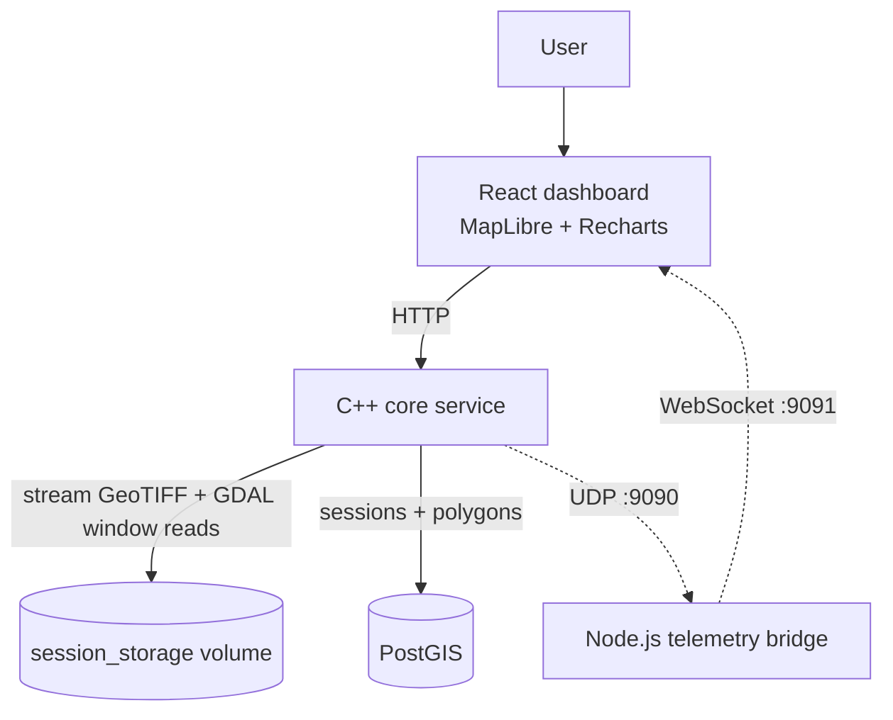
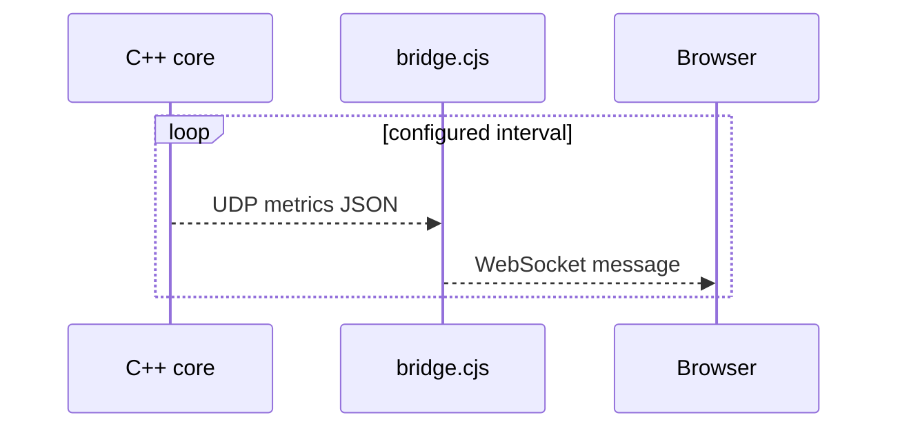
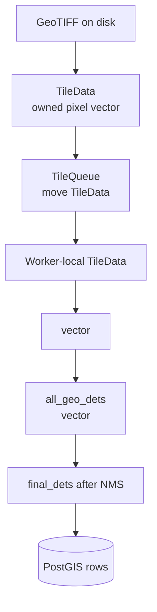
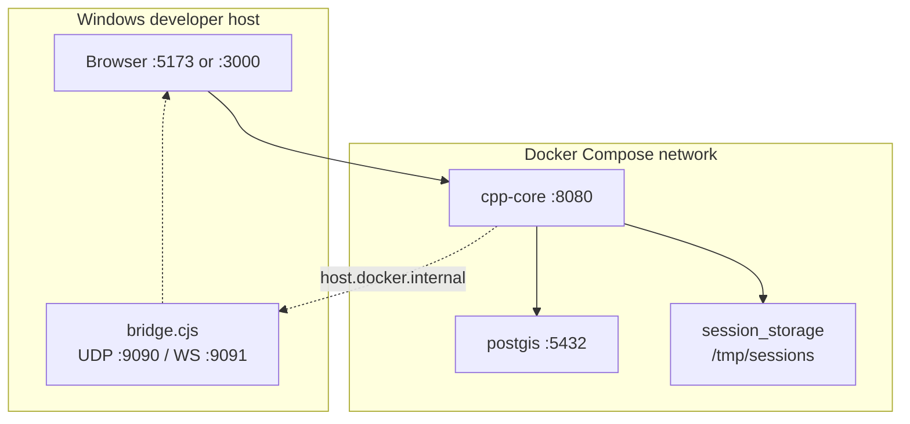

# Kiến Trúc Hệ Thống

Tài liệu này mô tả ranh giới runtime, luồng dữ liệu, quyền sở hữu dữ liệu và cách đọc source code của remote-sensing pipeline. Nếu muốn xem chi tiết từng bước trong một session, đọc tiếp [Luồng Pipeline](PIPELINE.md).

---

## 1. Mục Tiêu Thiết Kế

Kiến trúc được xây dựng theo các yêu cầu chính của đề tài:

1. Xử lý GeoTIFF lớn mà không nạp toàn bộ ảnh vào RAM.
2. Khai thác CPU đa luồng nhưng tránh unbounded queue và data race.
3. Tách HTTP control đáng tin cậy khỏi telemetry UDP độ trễ thấp.
4. Bảo toàn thông tin không gian từ pixel đến polygon PostGIS.
5. Cô lập lỗi file, worker và database trong từng session.
6. Cho phép thay backend AI mà không sửa pipeline chính.

Hệ thống hiện là một core service module hóa, chạy trong Docker Compose. Cơ chế xử lý song song nằm bên trong process C++ thông qua `ThreadPool`.

---

## 2. Bối Cảnh Hệ Thống

### Thành phần runtime

| Thành phần | Trách nhiệm | File chính |
| --- | --- | --- |
| Dashboard trình duyệt | Upload, cấu hình, polling, metrics, vẽ bản đồ | `frontend/src/App.jsx`, `components/`, `api/backend.js` |
| Telemetry bridge | Nhận UDP trên host và gửi WebSocket cho browser | `frontend/bridge.cjs` |
| HTTP gateway | Stream upload và expose session API | `cpp-core/src/api/http_gateway.*` |
| Session manager | Quản lý context mutable theo session | `cpp-core/src/main.cpp` |
| Processing pipeline | Điều phối tiling, worker, inference, stitching, saving | `runPipelineAsync()` trong `main.cpp` |
| Spatial database | Lưu session state và polygon WGS84 | `database/init.sql`, `postgis_client.*` |
| UDP broadcaster | Lấy metric và gửi JSON telemetry | `monitoring/udp_broadcaster.*` |

---

## 3. Hai Kênh Giao Tiếp

### 3.1 Control/data plane: HTTP/TCP

HTTP dùng cho dữ liệu cần tin cậy:

- upload GeoTIFF;
- cấu hình session;
- start/cancel;
- status polling;
- lấy kết quả GeoJSON.

Handler `/upload` ghi từng chunk xuống disk khi cpp-httplib nhận dữ liệu, không tạo buffer chứa toàn bộ request body trong RAM ứng dụng.

### 3.2 Observability plane: UDP/WebSocket

C++ core gửi telemetry khoảng mỗi 500 ms. Mất một gói UDP không ảnh hưởng đúng đắn vì gói tiếp theo sẽ thay thế.

Bridge hiện chạy trên host Windows, không nằm trong frontend container.

---

## 4. Phân Rã C++ Core

Nguyên tắc tách module:

- `main.cpp` là composition root, chịu trách nhiệm nối các module.
- `HttpGateway` chỉ biết callback, không biết chi tiết database/pipeline.
- `ThreadPool` chỉ biết `WorkerFn`, không phụ thuộc ONNX hoặc GDAL.
- Các backend AI cùng implement `AIInterface`.
- `CoordinateMapper` phụ thuộc metadata GDAL, không phụ thuộc model cụ thể.
- `PostGISClient` nhận kết quả cuối dạng `GeoDetection`.

Nhờ vậy MockAI, YOLO, DOTA OBB và SegFormer dùng chung hạ tầng tiling/worker/mapping.

---

## 5. Quyền Sở Hữu Session

`SessionManager` giữ `shared_ptr<SessionContext>` cho từng session.

| Trường | Ý nghĩa | Đồng bộ |
| --- | --- | --- |
| `config` | Cấu hình tile, model, worker, confidence | `ctx->mutex` |
| `filepath` | Đường dẫn file upload | Gần như immutable sau upload |
| `info` | State, progress, footprint, error message | `ctx->mutex` |
| `cancel_requested` | Cờ cancel hợp tác | `std::atomic<bool>` |
| `pool` | Worker pool của lần chạy hiện tại | `ctx->mutex` khi publish/read |

Thread pipeline capture `shared_ptr`, nên context còn sống cho đến khi pipeline kết thúc, dù HTTP request đã trả response.

---

## 6. Quyền Sở Hữu Dữ Liệu

- Pixel buffer lớn được move qua queue, không copy qua từng boundary.
- Một `TileData` chỉ thuộc về một worker tại một thời điểm.
- `Detection` là kết quả pixel-space của AI.
- `GeoDetection` là kết quả sau khi map sang WGS84.
- `all_geo_dets` giữ toàn bộ kết quả đến điểm fan-in vì stitcher cần nhìn toàn cục.

---

## 7. Mô Hình Lưu Trữ

PostGIS có hai bảng chính:

- `sessions`: filename, status, progress và timestamps.
- `detections`: session id, polygon EPSG:4326, class id và confidence.

Index:

- GiST trên `geom` để hỗ trợ truy vấn không gian.
- B-tree trên `session_id` để lấy kết quả theo session.

`postgis_data` là Docker volume persist toàn bộ database PostgreSQL/PostGIS. Nó không lưu trực tiếp `vector<GeoDetection>` C++, mà lưu các row sau khi C++ serialize polygon thành WKT và insert vào bảng `detections`.

---

## 8. Topology Docker

`session_storage` là Docker named volume mount vào `cpp-core` tại `/tmp/sessions`. Vì vậy file upload không xuất hiện trực tiếp trong thư mục project Windows trừ khi đổi sang bind mount.

---

## 9. Thứ Tự Đọc Source Code

Nên đọc theo thứ tự:

1. [`common/types.hpp`](../cpp-core/src/common/types.hpp): các struct dùng xuyên module.
2. [`main.cpp`](../cpp-core/src/main.cpp): wiring, session flow, `runPipelineAsync()`.
3. [`tiling_engine.cpp`](../cpp-core/src/pipeline/tiling_engine.cpp): đọc raster theo window.
4. [`tile_queue.hpp`](../cpp-core/src/pipeline/tile_queue.hpp): bounded blocking queue.
5. [`thread_pool.cpp`](../cpp-core/src/pipeline/thread_pool.cpp): vòng đời worker.
6. [`ai_interface.hpp`](../cpp-core/src/inference/ai_interface.hpp): contract AI.
7. [`coordinate_mapper.cpp`](../cpp-core/src/pipeline/coordinate_mapper.cpp): pixel -> WGS84.
8. [`stitcher.cpp`](../cpp-core/src/stitching/stitcher.cpp): NMS toàn cục.
9. [`postgis_client.cpp`](../cpp-core/src/database/postgis_client.cpp): insert, GeoJSON, coverage.
10. [`http_gateway.cpp`](../cpp-core/src/api/http_gateway.cpp): external API.

---

## 10. Trade-off Kiến Trúc

### Chủ động lựa chọn

- GDAL windowed I/O thay vì decode toàn ảnh.
- Bounded queue thay vì producer chạy tối đa.
- Nhiều ONNX session độc lập thay vì gọi đồng thời vào một session không bảo vệ.
- HTTP cho điều khiển tin cậy, UDP cho telemetry tạm thời.
- PostGIS geography area cho coverage thay vì tính diện tích theo độ lon/lat trong browser.

### Thỏa hiệp hiện tại

- Pipeline bất đồng bộ nhưng vẫn nằm trong một process/một máy.
- Stitching chờ toàn bộ worker và chạy một thread.
- Kết quả được gom trong RAM trước khi insert database.
- `StateMachine` đã có test nhưng runtime chưa đi qua một transition gate duy nhất.
- Coverage resolve overlap cho thống kê, không sửa lại polygon đã lưu.
