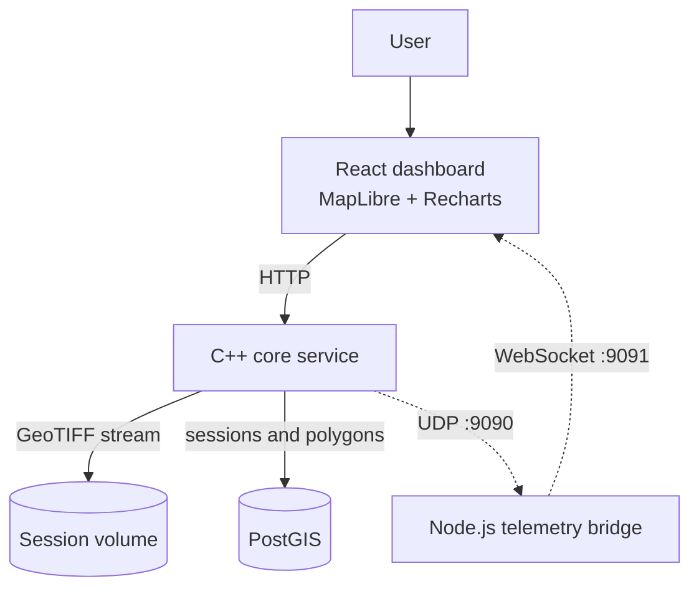
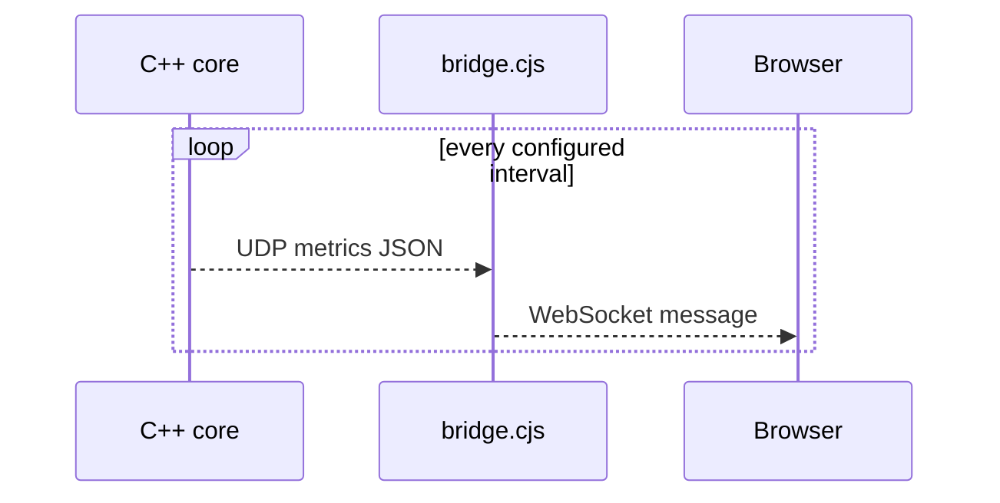
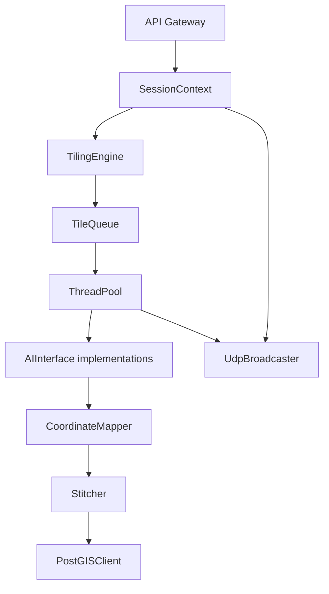
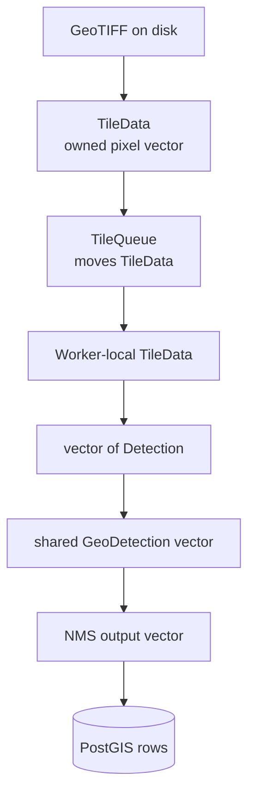
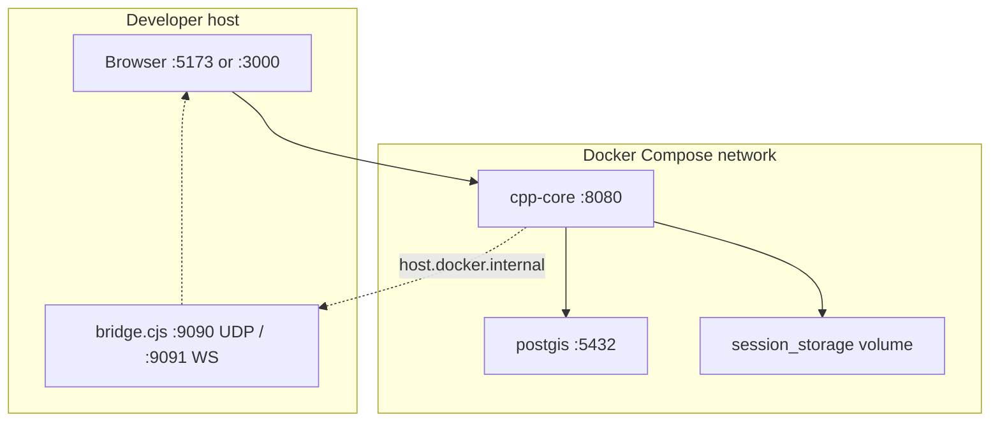

# System Architecture

This document explains the runtime boundaries, data flow, ownership model, and
source layout of the remote-sensing pipeline. For the exact execution path
inside one session, continue with [Pipeline Walkthrough](PIPELINE.md).

## Design goals

The architecture follows the original project requirements:

1. Process GeoTIFF files that are too large to load into memory as one image.
2. Use CPU resources concurrently without unbounded queues or data races.
3. Keep reliable HTTP control separate from lossy, low-latency telemetry.
4. Preserve geospatial metadata from source pixels to PostGIS polygons.
5. Isolate file, worker, and database failures to one session.
6. Keep inference replaceable so pipeline code does not depend on one model.

The implementation is a modular single-core service rather than a distributed
cluster. Docker Compose supplies deployment isolation and service discovery,
while C++ threads provide parallelism inside the core process.

## System context

### Runtime components

| Component | Responsibility | Important files |
| --- | --- | --- |
| Browser dashboard | Upload, configuration, polling, metrics, map rendering | `frontend/src/App.jsx`, `components/`, `api/backend.js` |
| Telemetry bridge | Receive host UDP and fan out messages to browsers | `frontend/bridge.cjs` |
| HTTP gateway | Stream uploads and expose session routes | `cpp-core/src/api/http_gateway.*` |
| Session manager | Own per-session mutable context | `cpp-core/src/main.cpp` |
| Processing pipeline | Coordinate tiling, workers, inference, stitching, saving | `cpp-core/src/main.cpp::runPipelineAsync` |
| Spatial database | Persist session state and WGS84 polygons | `database/init.sql`, `database/postgis_client.*` |
| Telemetry broadcaster | Sample process/system state and send UDP JSON | `monitoring/udp_broadcaster.*` |

## Two communication planes

The system deliberately uses two communication paths.

### Control and data plane: HTTP/TCP

HTTP carries operations that must be reliable:

- raw GeoTIFF upload;
- session configuration;
- start and cancel commands;
- status polling;
- GeoJSON result retrieval.

The upload handler writes chunks to disk as cpp-httplib receives them. The
server therefore does not first materialize the complete request body in an
application buffer. TCP supplies ordering and retransmission.

### Observability plane: UDP and WebSocket

The C++ broadcaster sends metrics approximately every 500 ms. A lost metrics
packet is acceptable because the next packet supersedes it. Browsers cannot
open UDP sockets, so `bridge.cjs` translates UDP datagrams into WebSocket
messages.

The bridge is currently a host process, not part of the frontend container.

## C++ core decomposition

The core uses dependency direction rather than inheritance-heavy orchestration:

- `main.cpp` owns the application lifecycle and wires callbacks.
- `HttpGateway` knows callback interfaces, not database or pipeline details.
- `ThreadPool` knows only a `WorkerFn`, not ONNX or GDAL.
- AI backends implement `AIInterface` and return the shared `Detection` type.
- `CoordinateMapper` depends on GDAL metadata, not on a specific model.
- `PostGISClient` receives final `GeoDetection` values.

This separation is why MockAI, YOLO, DOTA OBB, and SegFormer can share the same
tiling and worker infrastructure.

## Session ownership

`SessionManager` owns a `shared_ptr<SessionContext>` for every uploaded session.
The context contains:

| Field | Meaning | Synchronization |
| --- | --- | --- |
| `config` | Tile and inference settings | `ctx->mutex` |
| `filepath` | Uploaded file path | Effectively immutable after upload |
| `info` | State, progress, footprint, error message | `ctx->mutex` |
| `cancel_requested` | Cooperative cancellation flag | `std::atomic<bool>` |
| `pool` | Worker pool for the active run | `ctx->mutex` during publication/access |

The asynchronous pipeline captures the shared context, so it stays alive until
the detached pipeline thread exits even if the HTTP request has completed.

## Data ownership through the pipeline

Large pixel buffers are moved into and out of the queue. They are destroyed
after each worker callback returns. Geospatial results are smaller but remain in
`all_geo_dets` until the fan-in point because the current stitcher needs a global
view.

## Persistence model

PostGIS contains two tables:

- `sessions`: filename, state, progress, and timestamps;
- `detections`: session foreign key, EPSG:4326 polygon, class, and confidence.

The geometry and session indexes serve different query patterns:

- GiST on `geom` supports spatial predicates;
- B-tree on `session_id` supports result retrieval per pipeline run.

The image footprint currently lives in `SessionInfo` memory and is returned by
the status API. It is passed to the result query for land-cover coverage but is
not persisted in the `sessions` table.

## Deployment topology

`cpp-core` uses a multi-stage GDAL image. The builder installs CMake, libpqxx,
and ONNX Runtime; the runtime stage contains only the executable, required
shared libraries, and model directory.

## Source-code map

Start reading in this order:

1. [`common/types.hpp`](../cpp-core/src/common/types.hpp): values crossing module
   boundaries.
2. [`main.cpp`](../cpp-core/src/main.cpp): dependency wiring and session flow.
3. [`tiling_engine.cpp`](../cpp-core/src/pipeline/tiling_engine.cpp): disk-windowed
   raster reads.
4. [`tile_queue.hpp`](../cpp-core/src/pipeline/tile_queue.hpp): bounded blocking
   queue.
5. [`thread_pool.cpp`](../cpp-core/src/pipeline/thread_pool.cpp): worker lifetime.
6. [`ai_interface.hpp`](../cpp-core/src/inference/ai_interface.hpp): inference
   contract.
7. [`coordinate_mapper.cpp`](../cpp-core/src/pipeline/coordinate_mapper.cpp):
   pixel-to-world conversion.
8. [`stitcher.cpp`](../cpp-core/src/stitching/stitcher.cpp): global NMS.
9. [`postgis_client.cpp`](../cpp-core/src/database/postgis_client.cpp): persistence,
   GeoJSON, and coverage SQL.
10. [`http_gateway.cpp`](../cpp-core/src/api/http_gateway.cpp): external API.

## Architectural tradeoffs

### Chosen intentionally

- Disk-windowed GDAL I/O instead of whole-image decoding.
- Bounded queues instead of maximum producer throughput.
- One ONNX session per available AI slot instead of concurrent calls into one
  unprotected session.
- HTTP polling for durable session progress and UDP for transient telemetry.
- PostGIS geography area for coverage instead of browser degree-based area.

### Current compromises

- The pipeline is asynchronous but remains inside one process and one machine.
- Stitching waits for all workers and runs on one thread.
- Results accumulate in memory before one database transaction.
- The state-machine class is tested but runtime state assignments still happen
  directly in `main.cpp`.
- Coverage resolves conflicts for statistics without modifying stored polygons.

These are implementation facts, not hidden guarantees. They define the most
valuable directions for a future production version.
