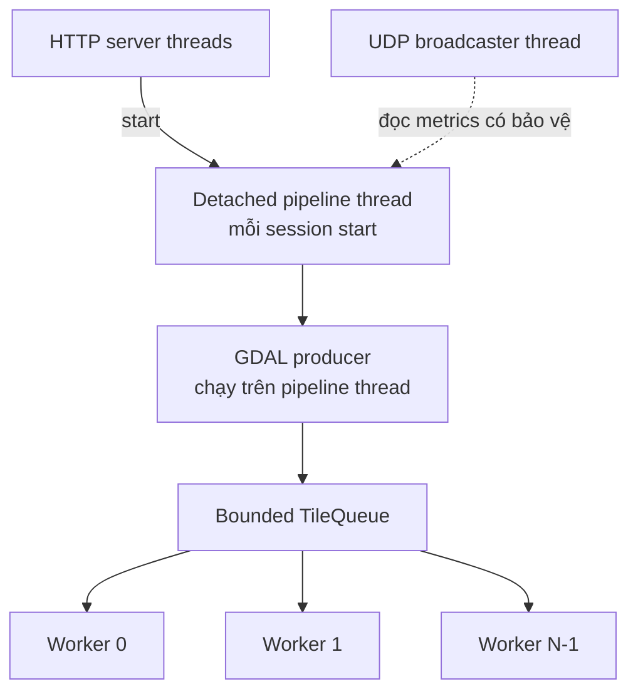

# Đa Luồng Và Backpressure

Tài liệu này giải thích các thread trong hệ thống, cách chúng giao tiếp, và tài nguyên nào cần đồng bộ.

---

## 1. Topology Các Thread



Không có tiling thread riêng. Thread pipeline chính là producer. Đa luồng bắt đầu khi `ThreadPool::start()` tạo worker trước khi `iterateTiles()` sinh tile.

---

## 2. Bounded Blocking Queue

`ThreadSafeQueue<T>` dùng:

- `std::queue<T>` để lưu item;
- một mutex cho queue state;
- `cv_not_empty_` cho consumer;
- `cv_not_full_` cho producer;
- cờ `closed_` cho shutdown/cancel.

### Thao tác push

```text
lock queue
wait đến khi queue còn chỗ hoặc queue đóng
nếu closed: return false
move item vào queue
notify một consumer
```

### Thao tác pop

```text
lock queue
wait đến khi queue có item hoặc queue đóng
nếu closed và empty: return nullopt
move front item ra ngoài
notify một producer
```

### Thao tác close

`close()` set cờ và đánh thức cả producer lẫn consumer. Nhờ đó:

- consumer đang chờ có thể thoát;
- producer đang block vì queue đầy sẽ tỉnh dậy và trả failure khi cancel.

---

## 3. Vì Sao Cần Backpressure?

Nếu queue không giới hạn, GDAL đọc ảnh có thể nhanh hơn AI inference. Khi đó RAM tăng theo:

```text
queued memory = số tile đang chờ * width * height * band_count
```

Với tile `1024 x 1024`, 4 band, mỗi tile khoảng 4 MiB. Nếu hàng nghìn tile nằm chờ, RAM có thể tăng lên nhiều GB.

Runtime đặt:

```text
queue capacity = worker count * 2
```

Với 4 workers, tối đa 8 tile nằm chờ trong queue. RAM vẫn còn đến từ active worker, GDAL buffer, ONNX tensor, model weights và vector kết quả, nhưng queue không còn tăng theo kích thước ảnh nguồn.

---

## 4. Move Semantics Và Quyền Sở Hữu

`submit(TileData tile)` nhận tile theo value, rồi move vào queue. `pop()` move tile ra `optional<TileData>` local của worker.

Ý nghĩa:

- không copy pixel vector lớn;
- một tile chỉ có một owner tại một thời điểm;
- pixel buffer được giải phóng khi worker callback kết thúc.

---

## 5. Inventory Đồng Bộ

| Tài nguyên chia sẻ | Primitive | Lý do |
| --- | --- | --- |
| Queue và cờ closed | Queue mutex + condition variables | Điều phối producer/consumer |
| Session config, status, footprint, pool pointer | `ctx->mutex` | HTTP, pipeline, cancel và telemetry cùng đọc/ghi |
| Yêu cầu cancel | `std::atomic<bool>` | Kiểm tra nhanh giữa nhiều thread |
| Completed tile count | `std::atomic<int>` | Nhiều worker cùng tăng |
| Cờ lỗi worker | `std::atomic<bool>` | Quyết định lỗi ở fan-in |
| First worker error string | `error_mutex` | Giữ một error message ổn định |
| `all_geo_dets` | `results_mutex` | Nhiều worker cùng `push_back` |
| Mỗi AI backend | một mutex per AI slot | Tránh gọi đồng thời vào session dùng chung |
| PostGIS client | `db_mutex` | Serialize một libpqxx connection |
| StateMachine callbacks | callback mutex nội bộ | Đăng ký/thông báo an toàn |

---

## 6. Ánh Xạ Worker Sang AI Session

Worker chọn AI object bằng:

```text
ai_index = worker_id % ai_pool.size()
```

Nếu số AI instance bằng số worker, mỗi worker có backend riêng. Nếu AI instance ít hơn worker, nhiều worker chia sẻ một instance và tuần tự hóa tại mutex của AI đó.

SegFormer hiện dùng:

```text
AI instances = min(worker count, 5)
```

Mục đích là giới hạn bộ nhớ model session. Tăng worker vượt số AI instance không làm tăng số inference chạy đồng thời, nhưng vẫn có thể overlap phần mapping/bookkeeping.

---

## 7. Chiến Lược Thread Cho ONNX

SegFormer cấu hình mỗi ONNX session:

- `intra_op_threads = 1`;
- `inter_op_threads = 1`;
- execution mode sequential;
- tắt CPU memory arena;
- bật graph optimization.

Cơ chế xử lý song song được tạo ở cấp nhiều ONNX session độc lập, tránh để mỗi session tự sinh nhiều thread nội bộ và gây oversubscription CPU.

---

## 8. Fan-in Và Hoàn Tất Có Trật Tự

`waitAll()` do pipeline thread gọi:

1. close queue;
2. cho worker xử lý nốt item đã nhận;
3. join toàn bộ worker;
4. clear worker handles;
5. reset queue.

Sau fan-in, pipeline mới kiểm tra `worker_failed` và `cancel_requested`, rồi mới quyết định có vào `STITCHING` hay không. Điều này tránh trường hợp báo `DONE` giả.

---

## 9. Cơ Chế Cancel

Cancel là cơ chế hợp tác:

1. HTTP set `cancel_requested`.
2. Queue đóng qua `requestStop()`.
3. Producer đang block tỉnh dậy, `submit()` trả false.
4. Worker idle thoát; worker đang inference sẽ hoàn thành call hiện tại.
5. Pipeline join worker.
6. Post-join check chuyển session sang `ERROR`, không stitching/saving.

Hiện API biểu diễn cancel bằng `ERROR` kèm message, chưa có state `CANCELLED` riêng.

---

## 10. Exception Trong Worker

Worker lambda bắt exception chuẩn và unknown exception. Lỗi đầu tiên sẽ:

- lưu error message;
- set `worker_failed`;
- set cancel flag;
- close queue;
- mark session `ERROR`.

Các worker khác có thể hoàn thành call đang chạy, nhưng sau fan-in pipeline không được đi vào `STITCHING -> SAVING -> DONE`.

---

## 11. Tuần Tự Hóa Database

Toàn bộ cập nhật progress, cập nhật status, insert và query kết quả dùng chung một `PostGISClient`. `db_mutex` bảo vệ libpqxx connection.

Điểm mạnh:

- đơn giản;
- tránh dùng một connection đồng thời từ nhiều thread.

Điểm yếu:

- query lớn có thể chặn progress update;
- chỉ một DB operation chạy tại một thời điểm;
- chưa phải connection pool production.

---

## 12. Tuning Hiệu Năng

Nên tuning theo thứ tự:

1. Chọn `tile_size` phù hợp input model.
2. Chọn overlap đủ lớn cho biên tile, nhưng tránh inference lặp quá nhiều.
3. Tăng số AI instance và đo RAM peak.
4. Match worker count với AI instance nếu inference là bottleneck.
5. Quan sát queue depth:
   - queue luôn đầy: inference chậm hơn producer;
   - queue luôn rỗng: I/O/preprocessing có thể là bottleneck.

Nhiều worker không luôn nhanh hơn. Nó làm tăng model sessions, active tile/tensor buffer, lock contention, DB traffic và scheduling overhead.

---

## 13. Hạn Chế Còn Lại

- Thread pipeline detached, chưa join khi process shutdown.
- Database chỉ có một serialized connection.
- `all_geo_dets` là một vector global có mutex.
- Stitching single-thread và chỉ bắt đầu sau khi fan-in xong.
- Runtime chưa dùng `StateMachine` làm transition gate duy nhất.
- Telemetry chỉ biểu diễn tốt một active session.
- Chưa có scheduler giới hạn tổng số session chạy đồng thời.
