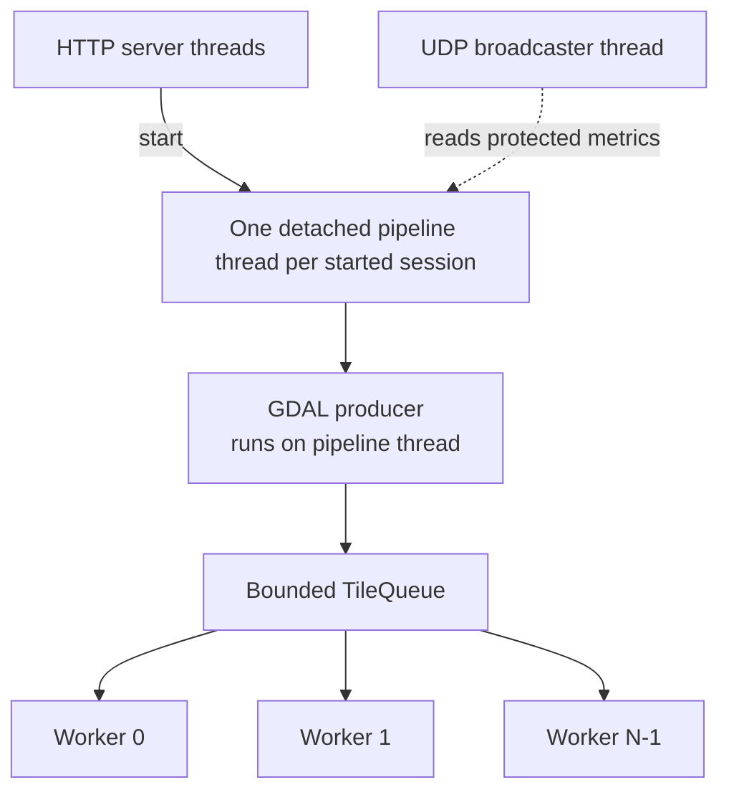

# Concurrency and Backpressure

This document explains which threads exist, how they communicate, and which
shared values require synchronization.

## Thread topology



There is no separate tiling thread: the pipeline thread itself is the producer.
Concurrency begins because `ThreadPool::start()` creates workers before
`iterateTiles()` starts producing.

## Bounded blocking queue

`ThreadSafeQueue<T>` uses:

- `std::queue<T>` for storage;
- one mutex for queue state;
- `cv_not_empty_` for consumers;
- `cv_not_full_` for the producer;
- a `closed_` flag for shutdown.

### Push

```text
lock queue
wait until queue has capacity OR queue is closed
if closed: return false
move item into queue
notify one consumer
```

### Pop

```text
lock queue
wait until queue has an item OR queue is closed
if closed and empty: return nullopt
move front item out
notify one producer
```

### Close

`close()` sets the flag and notifies both condition variables. This is important:

- idle consumers wake and exit when no work remains;
- a producer blocked on a full queue wakes and returns failure during cancel.

## Why backpressure matters

Without a capacity limit, raster I/O can outrun CPU inference. Approximate queued
memory would grow as:

```text
queued memory = queued tiles * tile width * tile height * band count
```

For 1,024 x 1,024 four-band byte tiles, one tile is about 4 MiB. Thousands of
queued tiles would consume gigabytes before inference catches up.

The runtime sets:

```text
queue capacity = worker count * 2
```

With four workers, no more than eight tiles wait in the queue. Additional memory
still exists in active workers, GDAL buffers, ONNX tensors, model weights, and
result vectors, but source size no longer determines queue growth.

## Move semantics and ownership

`submit(TileData tile)` receives a value, then moves it into the queue. `pop()`
moves it into a worker-local `optional<TileData>`. This avoids copying the large
pixel vector at every boundary.

Only one worker owns a given `TileData`. The worker callback receives a mutable
reference valid for that callback invocation. The tile and its pixel buffer are
released when the loop advances.

## Synchronization inventory

| Shared resource | Primitive | Why it is needed |
| --- | --- | --- |
| Queue contents and closed flag | Queue mutex + condition variables | Producer/consumer coordination |
| Session config, status, footprint, pool pointer | `ctx->mutex` | HTTP, pipeline, cancel, and telemetry access |
| Cancel request | `std::atomic<bool>` | Fast cooperative checks across threads |
| Completed tile count | `std::atomic<int>` | Concurrent worker increments |
| Worker failure flag | `std::atomic<bool>` | Fan-in failure decision |
| First worker error string | `error_mutex` | Preserve one coherent message |
| Global mapped result vector | `results_mutex` | Concurrent `push_back` from workers |
| Individual AI backend | one mutex per AI slot | Prevent concurrent use when workers share a session |
| PostGIS client | `db_mutex` | Serialize access to one libpqxx connection |
| State-machine callbacks | internal callback mutex | Safe registration/notification |

## Worker-to-AI mapping

Workers select an inference object with:

```text
ai_index = worker_id % ai_pool.size()
```

If the number of AI instances equals the number of workers, every worker has a
dedicated backend and its AI mutex has no contention. If there are fewer AI
instances, multiple workers share an instance and serialize at that mutex.

SegFormer currently uses:

```text
AI instances = min(worker count, 5)
```

This cap limits model-session memory. Creating more worker threads than AI
instances may still overlap mapping and bookkeeping, but it does not increase
simultaneous inference beyond the AI pool size.

## ONNX threading strategy

SegFormer configures each session with:

- one intra-op thread;
- one inter-op thread;
- sequential execution mode;
- CPU memory arena disabled;
- full graph optimization.

The application obtains parallelism from multiple independent sessions rather
than allowing every session to create a large internal CPU thread pool. This
reduces thread oversubscription and made four application-level sessions more
predictable on the development laptop.

## Fan-in and orderly completion

`waitAll()` is owned by the pipeline thread. It closes the queue and joins each
worker exactly once. Workers continue draining items already accepted before
the close. Only after the joins does the pipeline inspect failure/cancel flags
and enter stitching.

This ordering prevents a false completion path where the producer continues
submitting after workers have exited.

## Cancellation

Cancellation is cooperative:

1. HTTP sets `cancel_requested`.
2. The queue is closed with `requestStop()`.
3. A blocked producer wakes and `submit()` returns false.
4. Idle workers wake; workers already inside inference finish their current
   call because ONNX execution is not interrupted.
5. The pipeline joins workers.
6. The post-join check exits with `ERROR` instead of stitching or saving.

The current API represents cancellation as `ERROR` with an explanatory message;
there is no separate `CANCELLED` backend state.

## Worker exceptions

The worker lambda catches standard and unknown exceptions. The first failure:

- stores a stable error message;
- sets `worker_failed` and cancellation;
- closes the queue;
- marks session status `ERROR`.

Other workers may finish calls already in progress, but no successful
`STITCHING -> SAVING -> DONE` path is allowed after the fan-in check.

## Database serialization

All pipeline progress, status, inserts, and result queries share one
`PostGISClient`. A process-level mutex protects the underlying libpqxx
connection. This is safe but creates a database bottleneck:

- a large result query can delay progress updates;
- only one database operation runs at a time;
- it is not a substitute for a production connection pool.

## Performance tuning

Tune in this order:

1. Choose `tile_size` that matches model input and preserves useful spatial
   context.
2. Choose overlap large enough for boundary context but not so large that the
   same area is inferred repeatedly.
3. Increase AI instances while measuring peak RAM.
4. Match worker count to AI instances unless non-inference work is significant.
5. Inspect queue depth: a constantly full queue means inference is the
   bottleneck; a constantly empty queue suggests I/O or preprocessing limits.

More workers are not automatically faster. They add:

- model sessions and weights;
- active tile and tensor buffers;
- result-lock contention;
- database progress traffic;
- CPU scheduling overhead.

## Remaining concurrency limitations

- Pipeline threads are detached and are not joined during process shutdown.
- The database has one serialized connection.
- `all_geo_dets` has one global mutex and one global vector.
- Stitching is single-threaded and begins only after complete fan-in.
- Runtime status writes do not consistently use the standalone `StateMachine`.
- Telemetry exposes one `active_session_id`; concurrent sessions are not fully
  represented.
- There is no scheduler limiting how many sessions may create workers and model
  pools at the same time.

The bounded queue solves the most dangerous source-sized memory growth, but
production multi-session scheduling remains separate work.

