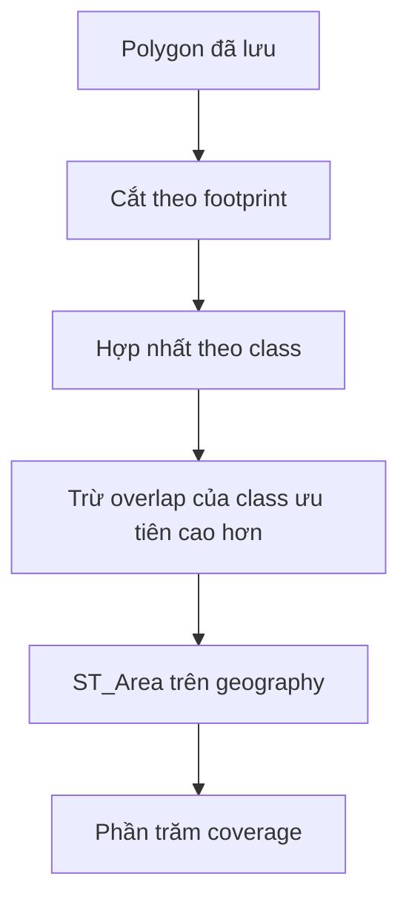

# Inference, Mapping, Stitching Và Coverage

Tài liệu này giải thích cách output của model AI trở thành polygon địa lý, và vì sao hệ thống có ba lớp xử lý overlap: NMS cục bộ, stitching toàn cục và union/difference trong PostGIS coverage.

---

## 1. Contract Chung Của AI Backend

Mọi backend implement [`AIInterface`](../cpp-core/src/inference/ai_interface.hpp):

```cpp
virtual std::vector<Detection> infer(const TileData &tile) = 0;
virtual std::string name() const = 0;
```

Pipeline phía sau chỉ nhìn thấy `Detection`, không phụ thuộc model framework hoặc layout tensor cụ thể.

---

## 2. Backend Hiện Có

| Backend | Input model | Output dùng trong project | Miền phù hợp |
| --- | --- | --- | --- |
| `MockAI` | Bất kỳ tile | Box giả lập deterministic | Test pipeline |
| `OnnxAI` | 640 x 640, 3 channel | COCO boxes, chưa decode prototype mask | Demo tích hợp ONNX |
| `OnnxObbAI` | 1024 x 1024 RGB | 4 góc xoay + class DOTA | Vật thể ảnh hàng không độ phân giải cao |
| `OnnxSegFormerAI` | 512 x 512 RGB, ImageNet normalization | Mask contour LoveDA | Land-cover segmentation |

Tất cả ONNX backend hiện dùng CPU Execution Provider.

---

## 3. Hành Vi Kênh Input

`TilingEngine` đọc mọi band nguồn và convert về byte. Backend hiện chưa khai thác arbitrary multispectral channels:

- ảnh 1 band được duplicate sang 3 channel nếu cần;
- ảnh >= 3 band dùng 3 band đầu;
- band NIR của NAIP hoặc các band Sentinel-2 chưa được đưa vào model hiện tại.

Vì vậy band ordering và tiền xử lý dữ liệu vẫn là trách nhiệm của người chuẩn bị dữ liệu.

---

## 4. Letterbox

DOTA và SegFormer giữ tỷ lệ tile:

```text
scale = min(model_width / tile_width, model_height / tile_height)
new size = round(tile size * scale)
padding = phần còn lại của model canvas / 2
```

Post-processing đảo ngược:

```text
tile_x = (model_x - pad_x) / scale
tile_y = (model_y - pad_y) / scale
```

Tọa độ được clamp vào kích thước tile thực tế, đặc biệt quan trọng với tile ở biên nhỏ hơn tile size cấu hình.

---

## 5. SegFormer Preprocessing

LoveDA backend:

1. Resize bilinear 3 band đầu.
2. Đặt ảnh vào canvas 512 x 512 theo letterbox.
3. Chuyển HWC byte sang NCHW float.
4. Scale byte về `0..1`.
5. Chuẩn hóa bằng ImageNet mean/std.

Output ONNX kỳ vọng rank 4:

```text
[batch, classes, output_height, output_width]
```

Project yêu cầu đúng 8 channel class:

```text
0 Ignore, 1 Background, 2 Building, 3 Road,
4 Water, 5 Barren, 6 Forest, 7 Agricultural
```

---

## 6. SegFormer Post-processing

### 6.1 Class và confidence theo cell

Với mỗi output cell, backend tính softmax qua class:

- `argmax` là class được chọn;
- xác suất class đó là confidence.

### 6.2 Local block

Output grid được xử lý theo block `4 x 4` cell:

1. Bỏ qua Ignore, Background và cell dưới `conf_thresh`.
2. Các cell còn lại vote class.
3. Class nhiều phiếu nhất thắng block.
4. Block cần ít nhất hai cell hợp lệ.
5. Sinh boundary edges quanh các cell được chọn.
6. Vòng biên lớn nhất trở thành một polygon.

Mỗi tile giữ tối đa 256 detections, sort theo confidence trung bình.

Điểm cần nhớ: polygonize này là cục bộ theo tile/block, không phải vectorize một semantic mask toàn ảnh đã stitch.

---

## 7. Pixel Sang Tọa Độ Địa Lý

Model trả tọa độ tile-local. `CoordinateMapper` cộng offset để ra pixel ảnh gốc:

```text
source_px = tile.pixel_x_offset + local_x
source_py = tile.pixel_y_offset + local_y
```

Sau đó áp dụng affine transform của GDAL:

```text
projected_x = gt[0] + px * gt[1] + py * gt[2]
projected_y = gt[3] + px * gt[4] + py * gt[5]
```

Nếu CRS nguồn là projected, OGR transform sang EPSG:4326. Điểm được lưu theo thứ tự longitude, latitude.

Nếu `Detection` có polygon, mapper chuyển toàn bộ vertex. Nếu không, mapper dùng bốn góc bbox. Cùng cơ chế này cũng tính footprint từ bốn góc ảnh.

---

## 8. Ba Vấn Đề Overlap

### 8.1 Duplicate cục bộ trong model

YOLO post-processing có NMS trong phạm vi một tile để loại nhiều anchor dự đoán cùng vật thể.

### 8.2 Duplicate giữa các tile

Tile overlap làm cùng một vật thể/vùng đất xuất hiện trong hai tile kề nhau. Sau khi worker xong, `Stitcher::runNMS()` xử lý duplicate trên toàn ảnh.

### 8.3 Đếm trùng diện tích coverage

NMS không đảm bảo geometry rời nhau. Same-class overlap dưới ngưỡng IoU và cross-class overlap vẫn có thể còn. Vì vậy coverage phải union/difference trong PostGIS khi query.

Ba bước này liên quan nhau nhưng không thay thế nhau.

---

## 9. Global NMS Hiện Tại

Stitcher:

1. Tính bbox lon/lat tạm cho mỗi polygon.
2. Sort detection theo confidence giảm dần.
3. Accept detection mạnh nhất chưa bị suppress.
4. Chỉ so sánh với detection cùng class.
5. Suppress candidate nếu bbox IoU > `0.5`.

```text
IoU = intersection_area / (area(A) + area(B) - intersection_area)
```

Lưu ý:

- bbox chỉ là cấu trúc phụ trợ;
- output vẫn là `GeoDetection` polygon WGS84;
- diện tích bbox đang tính theo degree lon/lat, không phải CRS metric;
- worst-case complexity là `O(n^2)`.

### NMS không làm các việc sau

- Không union polygon.
- Không cắt phần giao.
- Không so sánh khác class.
- Không blend semantic probability giữa tile.
- Không chạy song song với worker.

---

## 10. Lưu Vào PostGIS

Sau NMS, `insertDetections()` chuyển mỗi polygon sang WKT:

```text
POLYGON((lon lat, lon lat, ..., first_lon first_lat))
```

PostGIS tạo `GEOMETRY(Polygon, 4326)`. Tất cả row insert trong một libpqxx transaction, nên transaction fail sẽ không để lại một phần kết quả dang dở.

`postgis_data` persist database PostgreSQL/PostGIS, không persist object C++ trực tiếp.

---

## 11. Truy Vấn GeoJSON

Result query dùng `ST_AsGeoJSON(geom)` và aggregate thành `FeatureCollection`.

Feature properties gồm:

- detection ID;
- class ID;
- confidence;
- session ID.

Frontend nhóm feature theo class và tạo fill/outline layer trong MapLibre.

---

## 12. Land-cover Coverage

Coverage dùng footprint GeoTIFF làm mẫu số:

```text
class coverage = diện tích class không chồng lặp / diện tích footprint * 100
```

SQL pipeline:



Chi tiết:

1. `ST_MakeValid` sửa geometry nếu có thể.
2. `ST_Intersection` clip detection theo footprint.
3. `ST_UnaryUnion(ST_Collect(...))` bỏ overlap trong cùng class.
4. Class union được ưu tiên theo confidence lớn nhất, rồi class ID.
5. `ST_Difference` gán cross-class overlap cho class ưu tiên cao hơn.
6. `ST_CollectionExtract(..., 3)` giữ polygon output.
7. `ST_Area(geometry::geography)` tính diện tích mét vuông.
8. `Unclassified` = footprint area - tổng diện tích class đã phân vùng.

---

## 13. Ý Nghĩa Của Unclassified

`Unclassified` không đồng nghĩa với model sai. Nó gồm:

- class Ignore và Background;
- output dưới `conf_thresh`;
- vùng bị loại bởi minimum-cell rule;
- ring nhỏ bị bỏ trong local contour extraction;
- phần footprint không sinh polygon.

Tăng confidence thường làm Unclassified tăng. Muốn đánh giá accuracy cần ground truth và metric như mIoU/F1.

---

## 14. Vì Sao Coverage Vẫn Xử Lý Overlap Sau NMS?

NMS chỉ loại detection cùng class có bbox IoU > 0.5. Do đó:

- same-class overlap dưới ngưỡng vẫn còn;
- khác class luôn có thể overlap;
- polygon có thể giao nhau dù bbox IoU nhỏ.

Nếu không union/difference trong PostGIS, một vùng có thể bị tính diện tích nhiều lần và tổng coverage sẽ không tạo thành partition 100%.

---

## 15. Hướng Stitching Semantic Tốt Hơn

Thiết kế dài hạn nên là raster-first stitching:

1. Giữ logits/probability của từng tile.
2. Map về output grid của ảnh gốc.
3. Blend overlap với weight giảm ảnh hưởng biên tile.
4. Chọn đúng một class cuối cùng cho mỗi pixel.
5. Polygonize mask toàn cục.
6. Simplify polygon và persist.

Cách này xử lý seam và cross-class conflict tốt hơn, nhưng cần chiến lược output bounded cho ảnh rất lớn, ví dụ mask block trên disk hoặc streaming polygonization.
