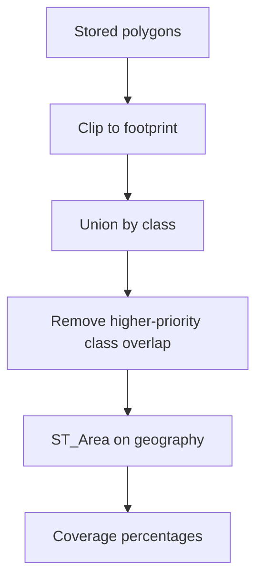

# Inference, Mapping, Stitching, and Coverage

This document explains how model output becomes a geospatial polygon and why
three different overlap treatments exist: model-local NMS, global stitching,
and PostGIS coverage union.

## Common inference contract

Every backend implements
[`AIInterface`](../cpp-core/src/inference/ai_interface.hpp):

```cpp
virtual std::vector<Detection> infer(const TileData &tile) = 0;
virtual std::string name() const = 0;
```

The rest of the pipeline therefore sees only `Detection`, regardless of model
framework or output tensor layout.

## Available backends

| Backend | Model input | Output used by this project | Intended domain |
| --- | --- | --- | --- |
| `MockAI` | Any tile | Deterministic synthetic boxes | Pipeline testing |
| `OnnxAI` | 640 x 640, three duplicated grayscale channels | COCO boxes; segmentation prototypes are not decoded | ONNX integration demo |
| `OnnxObbAI` | 1024 x 1024 RGB | Four rotated corners and DOTA class | High-resolution aerial objects |
| `OnnxSegFormerAI` | 512 x 512 RGB, ImageNet normalization | LoveDA local mask contours | Land-cover segmentation |

All ONNX backends currently use the CPU execution provider.

## Input channel behavior

`TilingEngine` reads every source band and converts it to one byte. Backends do
not currently consume arbitrary multispectral channels:

- one-band input is duplicated to three channels where required;
- three-or-more-band input uses the first three bands;
- a fourth NAIP NIR band or Sentinel-2 spectral bands are not used by the
  provided models.

Correct band ordering is therefore the caller/data-preparation responsibility.

## Letterboxing

DOTA and SegFormer preserve tile aspect ratio:

```text
scale = min(model_width / tile_width, model_height / tile_height)
new size = round(tile size * scale)
padding = remaining model canvas / 2
```

Post-processing reverses the transform:

```text
tile_x = (model_x - pad_x) / scale
tile_y = (model_y - pad_y) / scale
```

Coordinates are clamped to the actual tile dimensions, which matters for edge
tiles smaller than the configured tile size.

## SegFormer preprocessing

The LoveDA backend:

1. bilinearly resizes the first three source bands;
2. places the image on a black 512 x 512 letterbox canvas;
3. converts HWC bytes to NCHW floats;
4. scales bytes to `0..1`;
5. applies ImageNet mean and standard deviation normalization.

The ONNX output is expected to have rank four:

```text
[batch, classes, output_height, output_width]
```

The implementation requires exactly eight class channels:

```text
0 Ignore, 1 Background, 2 Building, 3 Road,
4 Water, 5 Barren, 6 Forest, 7 Agricultural
```

## SegFormer post-processing

### Per-cell class and confidence

For every output cell, the backend computes softmax across classes and keeps:

- the argmax class;
- its probability as confidence.

### Local blocks

The output grid is processed in blocks of `4 x 4` cells. Inside each block:

1. Ignore, Background, and below-threshold cells are skipped.
2. Remaining cells vote for a class.
3. The class with most votes wins the block.
4. At least two selected cells are required.
5. Boundary edges are generated around selected cells.
6. The largest closed boundary ring becomes one polygon.

At most 256 detections are retained per tile, sorted by average confidence.

This local vectorization keeps polygons manageable, but it is not equivalent to
vectorizing one globally stitched semantic mask. Disconnected components inside
one local block may lose smaller rings because only the largest ring is kept.

## Pixel-to-geographic mapping

Model output coordinates are tile-local. `CoordinateMapper` first adds the tile
offset to recover source-image pixels:

```text
source_px = tile.pixel_x_offset + local_x
source_py = tile.pixel_y_offset + local_y
```

It then applies the six-value GDAL affine transform:

```text
projected_x = gt[0] + px * gt[1] + py * gt[2]
projected_y = gt[3] + px * gt[4] + py * gt[5]
```

If the source CRS is projected, one OGR transform converts those coordinates to
EPSG:4326. `OAMS_TRADITIONAL_GIS_ORDER` ensures stored points use longitude,
latitude order.

If a detection supplies a polygon, every vertex is mapped. Otherwise, the four
bbox corners are mapped. The same mechanism maps the four image corners to the
GeoTIFF footprint.

## Three overlap problems

Overlap exists for different reasons and is handled at different stages.

### 1. Model-local duplicates

Generic YOLO post-processing performs tile-local NMS. It removes multiple
anchors predicting the same object inside one tile.

### 2. Cross-tile duplicates

Configured tile overlap makes the same object or land region appear in adjacent
tiles. After all workers finish, global `Stitcher::runNMS()` tries to remove
duplicates across the full image.

### 3. Coverage double counting

NMS does not guarantee disjoint geometry. Same-class low-IoU intersections and
all cross-class intersections can remain. Coverage calculation therefore unions
and partitions geometry at query time.

These stages are related but not interchangeable.

## Current global NMS

The stitcher:

1. computes one axis-aligned lon/lat bbox for every polygon;
2. sorts detections by descending confidence;
3. accepts the strongest unsuppressed detection;
4. compares it only with later detections of the same class;
5. suppresses a candidate when bbox IoU is greater than `0.5`.

For boxes `A` and `B`:

```text
IoU = intersection_area / (area(A) + area(B) - intersection_area)
```

Complexity is worst-case `O(n^2)`. Bounding-box area is calculated in longitude
and latitude degrees, not a projected metric CRS. This is acceptable as a local
dedup heuristic but is not a precise geodesic polygon IoU.

### What NMS does not do

- It does not union polygons.
- It does not trim partial intersections.
- It does not compare different classes.
- It does not blend semantic probabilities across tiles.
- It does not run concurrently with workers.

## PostGIS persistence

After NMS, `insertDetections()` converts each polygon into WKT:

```text
POLYGON((lon lat, lon lat, ..., first_lon first_lat))
```

PostGIS constructs `GEOMETRY(Polygon, 4326)`. All rows are inserted inside one
libpqxx transaction, so a failed transaction does not leave a partially saved
result set.

## GeoJSON retrieval

The result query uses `ST_AsGeoJSON(geom)` and aggregates rows into a standard
FeatureCollection. Feature properties contain:

- database detection ID;
- class ID;
- confidence;
- session ID.

The frontend groups features by class and adds one MapLibre fill and outline
layer per class.

## Land-cover coverage

Coverage uses the GeoTIFF footprint as denominator:

```text
class coverage = disjoint class area / footprint area * 100
```

The SQL pipeline is:



In detail:

1. `ST_MakeValid` repairs input geometry when possible.
2. `ST_Intersection` clips every detection to the footprint.
3. `ST_UnaryUnion(ST_Collect(...))` removes duplicate area within each class.
4. Class unions are ordered by maximum detection confidence, then class ID.
5. `ST_Difference` assigns cross-class overlap to the higher-priority class.
6. `ST_CollectionExtract(..., 3)` keeps polygonal output.
7. `ST_Area(geometry::geography)` calculates square metres on Earth.
8. `Unclassified` is footprint area minus summed disjoint class area.

The returned percentages form a partition and sum to approximately 100% after
floating-point rounding.

### Meaning of Unclassified

`Unclassified` is not the same as model error. It includes:

- model Ignore and Background classes;
- output below `conf_thresh`;
- regions removed by minimum-cell rules;
- smaller rings discarded by local contour extraction;
- valid footprint regions for which no polygon was emitted.

Raising confidence increases Unclassified coverage. Comparing Unclassified
against ground truth would require a labeled validation dataset.

## Why coverage still processes overlap after NMS

NMS removes only same-class detections with bbox IoU above 0.5. Therefore:

- same-class overlap below the threshold remains;
- different-class overlap always remains;
- polygon intersections may exist even when bbox IoU is small.

Without PostGIS union/difference, intersecting areas would be counted more than
once and class coverage plus Unclassified would not form a valid 100% partition.

## Recommended future semantic stitching

The correct long-term design for SegFormer is raster-first stitching:

1. keep class logits or probabilities for each tile;
2. map them into a source-image output grid;
3. blend overlap with weights that reduce tile-edge influence;
4. select exactly one class per source pixel;
5. vectorize the final global class mask;
6. simplify polygons and persist them.

That design removes cross-class overlap at its source, improves tile seams, and
makes coverage a direct pixel-count or polygon-area calculation. It also
requires a bounded output strategy for very large rasters, such as disk-backed
mask blocks or streaming polygonization.

