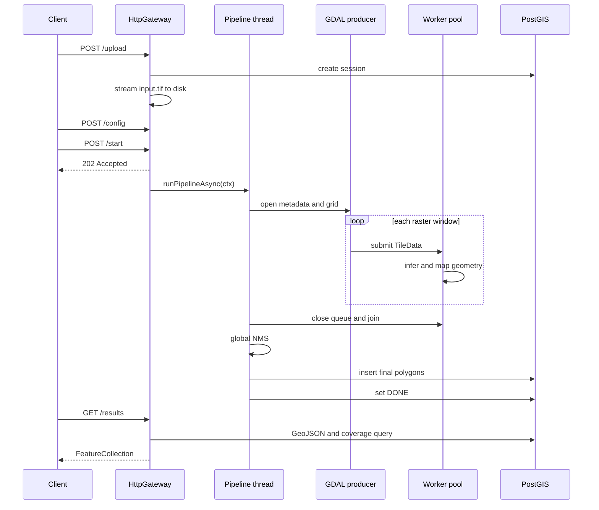
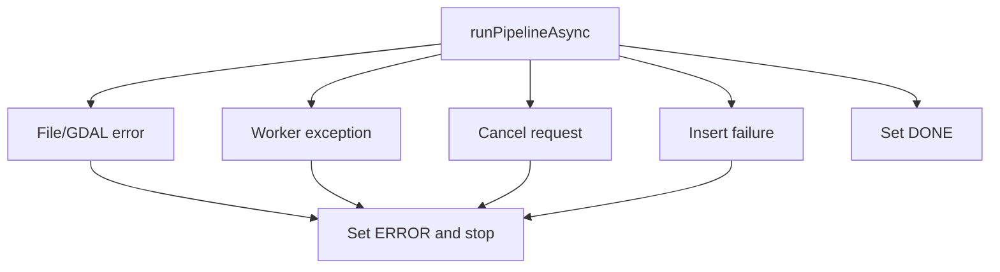

# Pipeline Walkthrough

This document follows one session through the code, from upload to GeoJSON. It
is centered on `runPipelineAsync()` in
[`main.cpp`](../cpp-core/src/main.cpp).

## End-to-end sequence



## Core data structures

All cross-module values are defined in
[`common/types.hpp`](../cpp-core/src/common/types.hpp).

### `TileData`

`TileData` is the unit of work passed through the queue:

- grid position: `tile_row`, `tile_col`, `tile_index`;
- source pixel offset: `pixel_x_offset`, `pixel_y_offset`;
- actual edge-aware `width` and `height`;
- `band_count`;
- interleaved HWC `std::vector<uint8_t> pixels`;
- owning `session_id`.

The expected pixel allocation is:

```text
tile bytes = width * height * band_count
```

GDAL converts every source band to `GDT_Byte`, then the tiler changes
band-sequential reads into HWC order.

### `Detection`

An inference backend returns tile-local output:

- axis-aligned `bbox`;
- optional arbitrary pixel `polygon`;
- `class_id`;
- `confidence`.

### `GeoDetection`

After coordinate mapping, the result contains a WGS84 polygon, class,
confidence, session ID, and source tile index. This is the value consumed by
stitching and persistence.

## Stage 1: upload and session allocation

The upload route has two application callbacks:

1. `UploadInitCallback` obtains a database-backed session ID.
2. The content receiver writes bytes to
   `/tmp/sessions/<session_id>/input.tif`.
3. `UploadCompleteCallback` records the final path, name, and size in the
   in-memory session context.

The HTTP response is returned only after the file receiver finishes. The
pipeline does not start implicitly; configuration and start are separate API
operations.

## Stage 2: configuration and validation

`PipelineConfig` controls:

```text
tile_size, overlap, model, model_path, max_workers, conf_thresh
```

The gateway rejects:

- non-positive or greater-than-4096 tile sizes;
- negative overlap or `overlap >= tile_size`;
- worker counts outside `0..64`;
- confidence outside `0..1`.

This validation is essential because tiling uses:

```text
stride = tile_size - overlap
```

A zero stride would make grid calculation invalid.

## Stage 3: asynchronous start

The start callback changes the session to `LOADING`, stores the active session
ID for telemetry, and launches a detached `std::thread`. The HTTP request returns
`202 Accepted` while processing continues.

The outer `try/catch` in `runPipelineAsync()` prevents an uncaught pipeline
exception from terminating the process. `markSessionError()` updates both the
in-memory session and the database when possible.

## Stage 4: open the GeoTIFF

`TilingEngine::validateFile()` checks:

1. file existence;
2. `.tif` or `.tiff` extension;
3. whether GDAL can open the file.

`open()` then reads:

- raster width and height;
- band count;
- six-value affine geotransform;
- source CRS WKT;
- whether the CRS is geographic.

The tile grid uses:

```text
stride = tile_size - overlap
columns = ceil(image_width / stride)
rows    = ceil(image_height / stride)
```

At the right and bottom edges, `actual_w` and `actual_h` shrink to the remaining
source pixels.

## Stage 5: prepare coordinate mapping

`CoordinateMapper` receives immutable `ImageMetadata` and creates one GDAL/OGR
coordinate transformation from the source CRS to EPSG:4326 when required.

The mapper also calculates the four-corner image footprint, which is stored in
`SessionInfo` for the status API and later coverage calculation.

## Stage 6: construct queue, workers, and AI sessions

The queue capacity is calculated as:

```text
queue_capacity = effective_worker_count * 2
```

`ThreadPool` starts `worker_count` threads. The model pool is constructed before
worker execution:

- Mock, generic YOLO, and DOTA normally create one backend per worker.
- SegFormer creates at most five ONNX sessions.
- Workers map to an AI slot with `worker_id % ai_pool.size()`.
- A per-slot mutex serializes workers that share the same backend.

If a model is absent or fails to initialize, the current code logs the error and
places a `MockAI` instance in that slot.

## Stage 7: worker callback

`ThreadPool::start()` stores a lambda as `worker_fn_`. Every `workerLoop(id)`
repeats:

```text
pop TileData -> worker_fn_(tile, id) -> destroy tile -> pop again
```

The injected callback performs:

1. select and lock one AI instance;
2. run `infer(tile)`;
3. map pixel output to WGS84;
4. append mapped values under `results_mutex`;
5. atomically increment `tiles_done`;
6. copy progress into `SessionInfo` under `ctx->mutex`;
7. update PostGIS every 20 completed tiles.

Any exception inside a worker records the first error, sets cancellation,
closes the queue, and updates the session to `ERROR`.

## Stage 8: producer iteration

After workers are running, the pipeline thread calls
`TilingEngine::iterateTiles()`.

For every grid cell:

1. `readTile()` calls `RasterIO` for each band;
2. a complete `TileData` is constructed;
3. the callback checks cancellation;
4. `pool->submit(std::move(tile))` transfers ownership to the queue.

If the bounded queue is full, submit blocks. GDAL therefore stops reading more
windows until inference frees queue capacity.

## Stage 9: fan-in

Once iteration ends, `waitAll()`:

1. closes the queue;
2. lets workers drain remaining items;
3. joins every worker thread;
4. clears worker handles;
5. resets the queue.

This is the fan-in barrier. No stitching or saving starts before every worker has
exited. After the barrier, the pipeline checks `worker_failed` and
`cancel_requested` to prevent false `DONE` states.

## Stage 10: stitching

The state changes to `STITCHING`, and `Stitcher::runNMS()` receives the complete
`all_geo_dets` vector. NMS runs on the pipeline thread and returns `final_dets`.

The current stitcher is global and batch-oriented. See
[Inference and Stitching](INFERENCE_AND_STITCHING.md) for the exact algorithm
and its limitations.

## Stage 11: saving

The state changes to `SAVING`. `PostGISClient::insertDetections()` opens one
transaction, converts every polygon to WKT, inserts it with SRID 4326, and
commits the transaction.

If insertion fails, the pipeline becomes `ERROR`. Only a successful insert is
followed by database and in-memory `DONE` state updates.

## Stage 12: result retrieval

`GET /sessions/{id}/results` performs two database operations:

1. aggregate stored rows into a GeoJSON `FeatureCollection`;
2. if a footprint is available, compute class coverage with PostGIS geography.

The response keeps standard GeoJSON fields and adds a top-level `coverage`
object for SegFormer visualization.

## State and error paths



Status/progress database update failures are logged because they should not
crash active inference. Final detection insertion is mandatory and therefore
fatal to the session.

## Memory lifetime

| Allocation | Lifetime |
| --- | --- |
| Uploaded GeoTIFF | Session volume until volume/session cleanup |
| GDAL tile buffer | Producer read through one worker callback |
| Queue tile buffers | While waiting, bounded by queue capacity |
| ONNX tensors | One inference call, plus runtime allocator behavior |
| AI sessions and weights | Complete pipeline run |
| `all_geo_dets` | Complete processing and stitching stages |
| `final_dets` | Stitching through database insertion |
| GeoJSON response | One result request and browser render |

The bounded queue solves unbounded pixel buffering. It does not bound detection
accumulation or GeoJSON response size.

