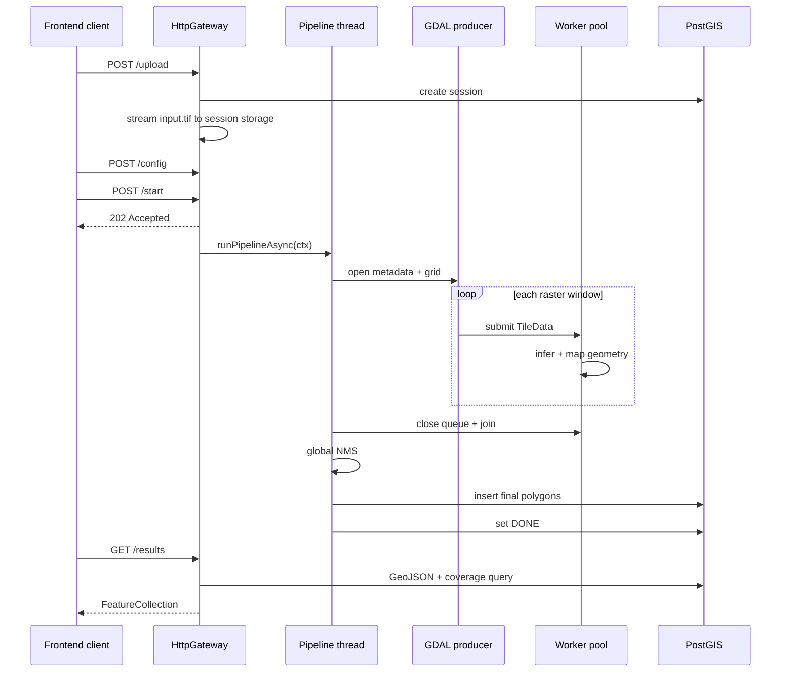
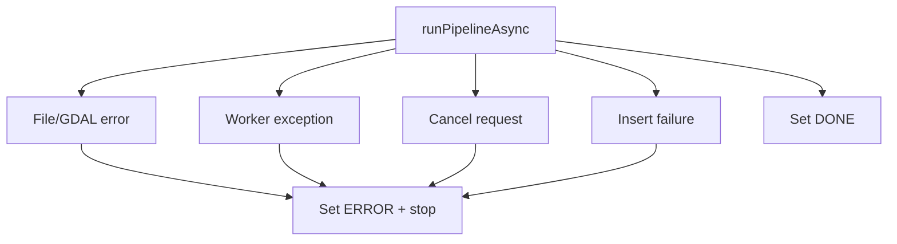

# Luồng Pipeline

Tài liệu này đi theo một session từ lúc upload GeoTIFF đến lúc frontend nhận GeoJSON. Trọng tâm là `runPipelineAsync()` trong [`main.cpp`](../cpp-core/src/main.cpp).

---

## 1. Sơ Đồ Tổng Thể



---

## 2. Cấu Trúc Dữ Liệu Chính

Các type xuyên module nằm trong [`common/types.hpp`](../cpp-core/src/common/types.hpp).

### `TileData`

Đơn vị công việc đi qua queue:

- `tile_row`, `tile_col`, `tile_index`;
- `pixel_x_offset`, `pixel_y_offset`;
- `width`, `height` thực tế, kể cả tile ở biên;
- `band_count`;
- `std::vector<uint8_t> pixels` dạng HWC;
- `session_id`.

```text
tile bytes = width * height * band_count
```

### `Detection`

Kết quả AI trong hệ tọa độ pixel của tile:

- `bbox`;
- `polygon` dạng `PixelPoint`;
- `class_id`;
- `confidence`.

### `GeoDetection`

Kết quả sau `CoordinateMapper`:

- polygon dạng `GeoPoint` WGS84;
- class;
- confidence;
- session ID;
- tile index.

Đây là kiểu dữ liệu được đưa vào stitching và PostGIS.

---

## 3. Bước 1: Upload Và Tạo Session

Route `/upload` có hai callback:

1. `UploadInitCallback` tạo session trong database và lấy session ID.
2. Content reader stream byte vào `/tmp/sessions/{session_id}/input.tif`.
3. `UploadCompleteCallback` ghi filepath, filename và size vào `SessionContext`.

HTTP response chỉ trả sau khi stream file xong. Pipeline không tự start sau upload; config và start là hai bước riêng.

---

## 4. Bước 2: Kiểm Tra Config

`PipelineConfig` gồm:

```text
tile_size, overlap, model, model_path, max_workers, conf_thresh
```

Gateway reject:

- `tile_size <= 0` hoặc `tile_size > 4096`;
- `overlap < 0` hoặc `overlap >= tile_size`;
- `max_workers` ngoài `0..64`;
- `conf_thresh` ngoài `0..1`.

Điều này quan trọng vì:

```text
stride = tile_size - overlap
```

Nếu stride bằng 0, grid tiling sẽ sai.

---

## 5. Bước 3: Start Bất Đồng Bộ

Start callback:

- chuyển session sang `LOADING`;
- lưu active session cho telemetry;
- tạo detached `std::thread`;
- HTTP trả `202 Accepted`.

`runPipelineAsync()` có outer `try/catch` để exception không làm terminate process. Khi lỗi, `markSessionError()` cập nhật cả in-memory session và database nếu có thể.

---

## 6. Bước 4: Mở GeoTIFF

`TilingEngine::validateFile()` kiểm tra:

1. file tồn tại;
2. đuôi `.tif` hoặc `.tiff`;
3. GDAL mở được file.

`open()` đọc:

- width, height;
- band count;
- affine geotransform 6 giá trị;
- CRS WKT;
- CRS geographic hay projected.

Grid:

```text
stride  = tile_size - overlap
columns = ceil(image_width / stride)
rows    = ceil(image_height / stride)
```

Tile ở mép phải/dưới có `actual_w`, `actual_h` nhỏ hơn tile size cấu hình.

---

## 7. Bước 5: Chuẩn Bị CoordinateMapper

`CoordinateMapper` nhận `ImageMetadata` immutable và tạo transform từ CRS nguồn sang EPSG:4326 nếu cần.

Mapper cũng tính footprint từ bốn góc ảnh. Footprint này dùng cho:

- `/status`;
- hiển thị viền ảnh nếu cần;
- tính Land Cover Coverage.

---

## 8. Bước 6: Queue, Worker Và AI Session

Queue capacity:

```text
queue_capacity = effective_worker_count * 2
```

Trước khi producer bắt đầu đọc tile:

- `ThreadPool` tạo `worker_count` threads.
- AI pool được tạo theo model.
- Mock, YOLO, DOTA thường tạo một backend per worker.
- SegFormer tạo tối đa 5 ONNX sessions.
- Worker chọn AI slot bằng `worker_id % ai_pool.size()`.

Nếu model missing hoặc init lỗi, code log lỗi và fallback sang MockAI.

---

## 9. Bước 7: Callback Của Worker

`ThreadPool::start()` lưu lambda vào `worker_fn_`. Mỗi worker chạy:

```text
pop TileData -> worker_fn_(tile, worker_id) -> destroy tile -> pop tiếp
```

Callback của worker thực hiện:

1. chọn và lock AI instance;
2. `infer(tile)` trả `vector<Detection>`;
3. `CoordinateMapper` map sang `vector<GeoDetection>`;
4. push vào `all_geo_dets` dưới `results_mutex`;
5. tăng `tiles_done`;
6. cập nhật `SessionInfo`;
7. update progress DB mỗi 20 tile.

Nếu worker lỗi, pipeline set `ERROR`, request stop queue và không đi tiếp sang stitching/saving.

---

## 10. Bước 8: Producer Sinh Tile

Sau khi worker đã chạy, pipeline thread gọi `TilingEngine::iterateTiles()`.

Mỗi grid cell:

1. `readTile()` gọi `RasterIO` từng band.
2. Tạo `TileData`.
3. Check cancel.
4. `pool->submit(std::move(tile))`.

Nếu queue đầy, `submit()` block. Vì vậy GDAL tạm dừng đọc thêm ảnh cho đến khi worker xử lý bớt tile.

---

## 11. Bước 9: Fan-in

Khi producer đọc hết tile, `waitAll()`:

1. close queue;
2. để worker xử lý nốt item đã nhận;
3. join toàn bộ worker;
4. clear worker handles;
5. reset queue.

Sau fan-in, pipeline kiểm tra `worker_failed` và `cancel_requested`. Nếu có lỗi/cancel, pipeline dừng và không báo `DONE`.

---

## 12. Bước 10: Stitching

Session chuyển sang `STITCHING`.

`Stitcher::runNMS()` nhận toàn bộ `all_geo_dets`:

- input là `vector<GeoDetection>`;
- mỗi polygon tạo bbox tạm để tính IoU;
- chỉ so sánh cùng class;
- output là `final_dets`, vẫn giữ polygon WGS84.

---

## 13. Bước 11: Lưu Database

Session chuyển sang `SAVING`.

`PostGISClient::insertDetections()`:

1. mở transaction;
2. chuyển polygon WGS84 sang WKT;
3. insert vào `detections.geom` với SRID 4326;
4. commit transaction.

Nếu insert fail, session chuyển `ERROR`. Chỉ khi insert thành công mới update `DONE`.

---

## 14. Bước 12: Lấy Kết Quả

`GET /sessions/{id}/results`:

1. Query polygon từ PostGIS và aggregate thành GeoJSON `FeatureCollection`.
2. Nếu có footprint, tính `coverage` bằng PostGIS geography.

Frontend dùng GeoJSON để vẽ polygon và dùng `coverage` để hiển thị tỷ lệ phủ lớp bề mặt.

---

## 15. State Và Error Path



Progress/status DB update fail chỉ log warning. Final insert fail là lỗi bắt buộc vì kết quả không được lưu.

---

## 16. Memory Lifetime

| Allocation | Lifetime |
| --- | --- |
| GeoTIFF upload | Trong `session_storage` cho đến khi xóa volume/session |
| GDAL tile buffer | Từ lúc producer đọc đến khi worker callback xong |
| Queue tile buffers | Khi tile đang chờ, bị giới hạn bởi queue capacity |
| ONNX tensors | Trong một inference call, cộng runtime allocator behavior |
| AI sessions/weights | Suốt một lần pipeline run |
| `all_geo_dets` | Từ processing đến hết stitching |
| `final_dets` | Từ stitching đến database insert |
| GeoJSON response | Một request `/results` và browser render |

Bounded queue giới hạn pixel buffer đang chờ. Nó không giới hạn số `GeoDetection` hoặc kích thước GeoJSON kết quả.
